## 

## PB7K325开发板简介

上海派普蓝电子科技有限公司 PB7K325 开发板基于 AMD Kintex‑7 XC7K325T‑2FFG900I FPGA 平台设计，FPGA 内集成 326 080 个等效逻辑单元（LUTs）、840 个 DSP48E1 硬核加速单元及 16 条 10.3125 Gb/s 高速收发通道（GTX），打造出高性价比、高性能的视频验证与算法原型平台，可满足多路浅度视频压缩、图像信号处理（ISP）算法的并行硬件加速需求。

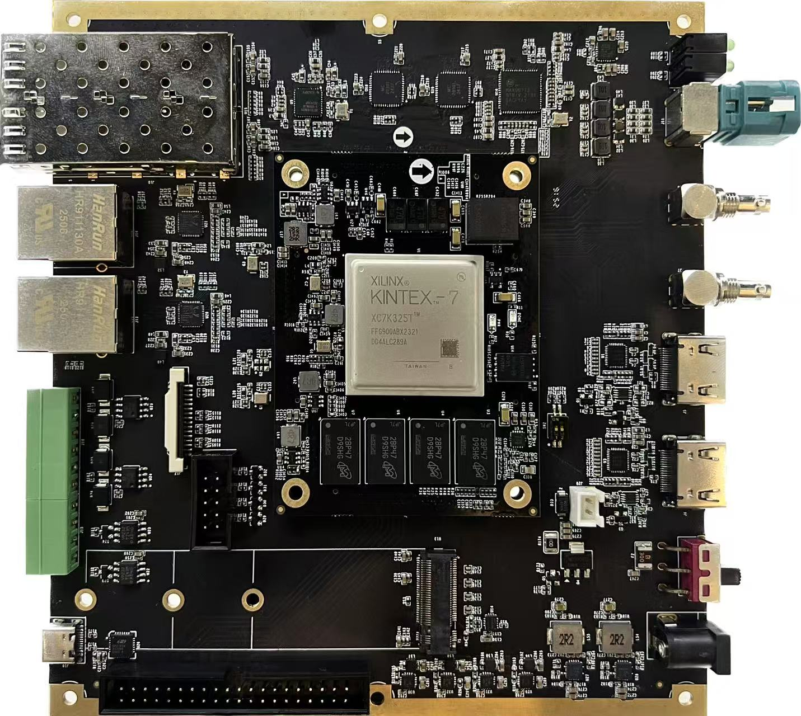

图 1：PB7K325开发板正面图

在这里，对上海派普蓝电子科技有限公司 AV7K325 开发平台进行简单的功能介绍。

开发板的整个结构，采用核心板+扩展板的模式设计，核心板与扩展板之间通过高速板间连接器实现高带宽、低时延的数据与控制信号传输。

核心板主要由 AMD FPGA芯片、4 颗 DDR3 存储器和 128 Mb QSPI Flash 构成最小系统。FPGA 采用 AMD Kintex‑7 系列高性能器件，型号为 XC7K325T‑2FFG900I；在器件的 HP（High Performance）端口上连接 4 颗 DDR3 DRAM，每颗容量 512 MB，总线宽度 64 bit，用于视频帧缓存与高速数据流处理；1 颗 128 Mb QSPI Flash 用于静态存储 FPGA 位流及用户数据，实现可靠的非易失化存储与快速启动。

底板为核心板扩展了丰富的外围接口，其中包含 1 路 HDMI 2.0 输入、1 路 HDMI 2.0 输出、2 路 12G SDI 输入输出、4 路 6G GMSL 输入（带 POC）、1 路 RS‑485接口、1 路 CAN接口、2 路 千兆以太网接口、2 路 SFP+ 万兆以太网光纤接口、1 路 MIPI接口、1 个 M.2 SSD 接口（PCIe 2.0 ×4）、1 个 40针扩展接口、以及 JTAG 与 UART调试接口。

该模块化设计不仅便于快速验证 FPGA 原型与视频算法，也可灵活对接各类视频源、工业总线与高速存储，为工程师提供高效的软硬件协同开发平台。
下图为整个开发系统的结构示意图：

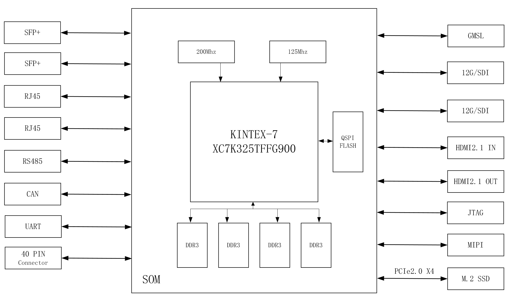
图 2：PB7K325结构示意图

通过这个示意图，我们可以看到，我们这个开发平台所能含有的接口和功能。

- FPGA 核心板
由 AMD Kintex‑7 XC7K325T‑2FFG900I FPGA + 4 颗 DDR3 存储器 + 128 Mb QSPI Flash 构成最小系统，同时集成两路高精度晶振参考时钟：

  - 单端 200 MHz 晶振，为 FPGA 逻辑与 DDR3 控制器提供低抖动（low-jitter）参考时钟；
  - 差分 125 MHz 晶振，为 GTX 高速收发器（SERDES）提供稳定的参考时钟，从而保证多通道 10 Gb/s 级链路的时序稳定性与信号完整性。

- 2 路 SFP+ 光纤接口
XC7K325T‑2FFG900I 器件内置 16 条 GTX 高速收发通道，通过 FPGA 自带的 10 Gb/s SERDES 硬核连接至 2 个 SFP+ 光模块，支持多模/单模光纤通信，最高链路速率可达 10 Gb/s，具备自适应均衡与抖动修正功能，满足长距离、低时延的光纤数据传输需求。

- HDMI 视频输出
一 路二合一 HDMI 接口，采用安森美公司的NB7NQ621M 芯片作为为 HDMI 2.0 视频输出接口，最高支持 4K@60Hz 输出，并支持不同格式的数据输出。

- HDMI 视频输入
一 路二合一 HDMI 接口，采用安森美公司的NB7NQ621M 芯片作为为 HDMI 2.0 视频输入接口，最高支持 4K@60Hz 输入，并支持不同格式的数据输入。

- 12G SDI输入输出
两路 SDI 接口输入输出，支持 SD/HD/3G/6G/12G SDI 速率，最高支持 4K/60 帧视频输入或者输出。

- M.2 接口
一路 M.2 Key M 插槽，直连 XC7K325T‑2FFG900I 芯片的 PCIe 2.0 ×4 通道，支持 NVMe 协议固态硬盘，链路速率单向最高可达 5 Gb/s，适用于大容量视频帧缓存与高速数据回放。

- TYPE-C–UART 接口
一路 UART 转 TYPE-C 接口，用于系统的串口调试与供电功能。该接口使用 Silicon Labs 公司的 CP2102GM USB-UART 转换芯片，具备稳定可靠的串口转接能力，广泛应用于工业级嵌入式调试场景。

- 40 针扩展口
一组 2.54 mm 间距 40-pin 扩展接口，可外接各类高带宽或多路传感模块（如双目摄像头、TFT LCD 驱动板、高速 ADC 模块等）；扩展口引脚包含：1 路 5 V 电源、2 路 3.3 V 电源、3 路地线、34 路 LVTTL/3.3 V 可编程 I/O，支持多种接口协议。

- JTAG 调试口
一路 10‑pin 2.54 mm 标准 JTAG 接口，连接 AMD Vivado JTAG 硬件调试器，用于 FPGA 位流下载、在线逻辑分析（ILA）与系统级调试，可实现对 FPGA 内部逻辑及时序的深度验证。

- LED 指示灯
核心板与扩展板共计 6 颗 LED：
  - 核心板：1 颗电源指示（POWER OK）、1 颗 FPGA 配置完成指示（DONE）；
  - 扩展板：1 颗电源指示；其余 3 颗可由用户通过 FPGA I/O 编程，实现系统状态或算法运行指示。

## PB7K325C核心板简介

PB7K325C核心板，FPGA 芯片选型自上海派普蓝电子科技有限公司，基于 AMD 公司 Kintex‑7 XC7K325T‑2FFG900I 系列器件；该核心板搭载 4 颗 Micron MT41J256M16HA‑125 DDR3 DRAM（每颗 512 MB，总计 2 GB），提供高达 25 GB/s 的理论带宽，用于帧缓存与深度流水线处理；同时集成 1 颗 128 Mbit QSPI Flash，用于存储 FPGA 配置位流及系统固件，实现快速启动与在场业升级。

核心板通过 4 个高密度板对板连接器共引出 276 路可编程 I/O，其中 BANK17 与 BANK18 的 92 路 I/O 支持通过更换板载 LDO 电源芯片实现电平兼容性切换（1.2 V/1.5 V/1.8 V/2.5 V），满足多种外设互联需求；此外，板上还预留了 16 对 AMD 原生 GTX 高速收发器通道（10.3125 Gb/s 级），可直连光纤、超声波接口或自定义高速传感器。

在 PCB 设计上，FPGA 至外设引脚线束全部采用差分对与等长匹配技术，严控阻抗偏差与时钟偏移，确保各信号通道的时序一致性与信号完整性；超紧凑的 80 × 60 mm 板型设计，不仅便于二次开发与机箱集成，也大幅降低系统采样引入延迟与 EMI 干扰。该核心板凭借丰富的可扩展 I/O 与专业级高速通道，为大规模并行算法验证与异构系统集成提供了高效、可靠的硬件基础。

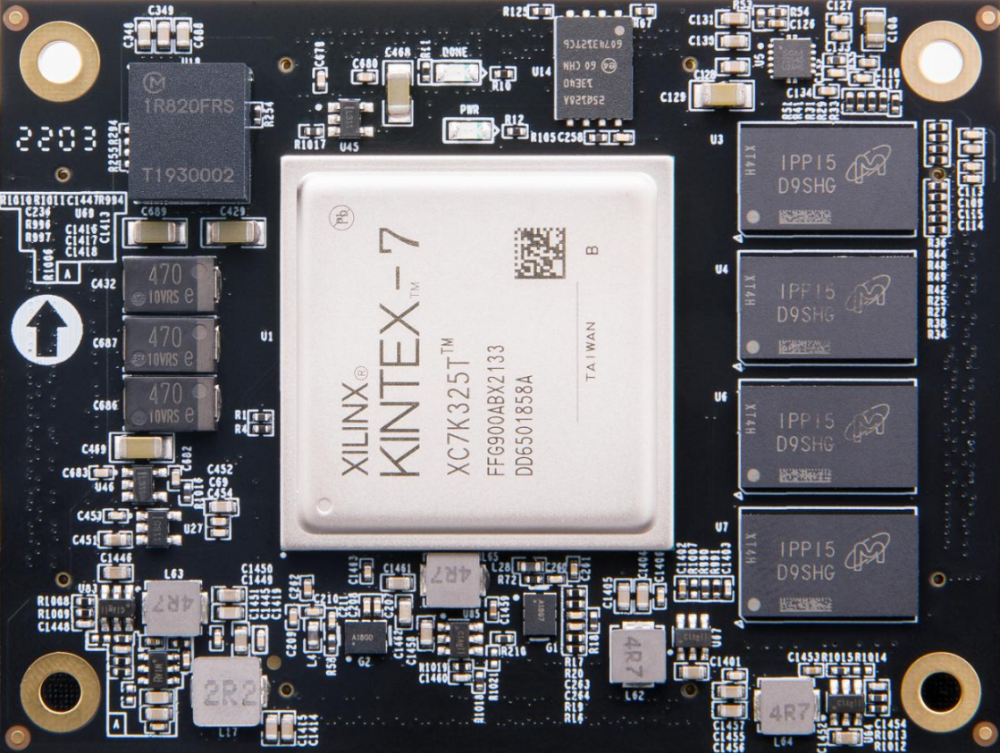

图 3：PB7K325C核心板正面图

### XC7K325芯片

核心板使用的是 AMD 公司的 KINTEX-7 FPGA 芯片，型号为 XC7K325T-2FFG900I。速度等级为 2，温度等级为工业级。此型号为 FGG900 封装，900 个引脚，引脚间距为 1.0mm。
AMD KINTEX-7 FPGA 的芯片命名规则如下图所示：

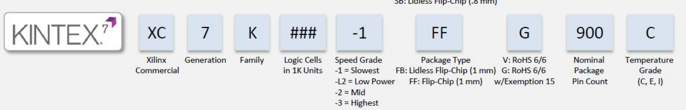
图 4：KINTEX-7系列芯片型号定义

下图为开发板所用的XC7K325芯片实物图。

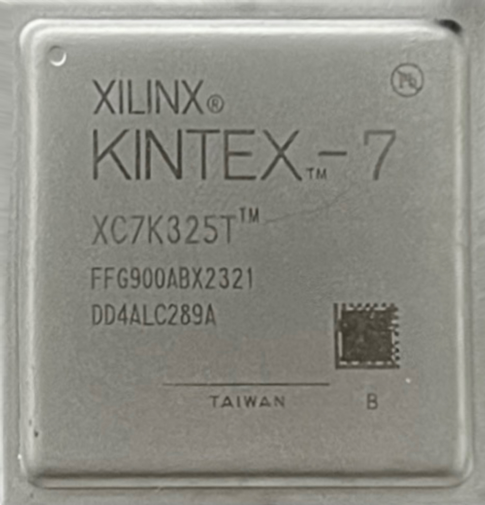
图 5：XC7K325芯片实物

### 电源

PB7K325C 核心板的供电电压为 DC 5 V，通过底板的 5 V 电源连接器引入，由板载电源管理模块（包含 DCDC 与 LDO 混合稳压方案）产生 FPGA 核心域与 I/O 域所需的各路工作电压，确保系统稳定可靠运行。
板上的电源设计示意图如下图所示:

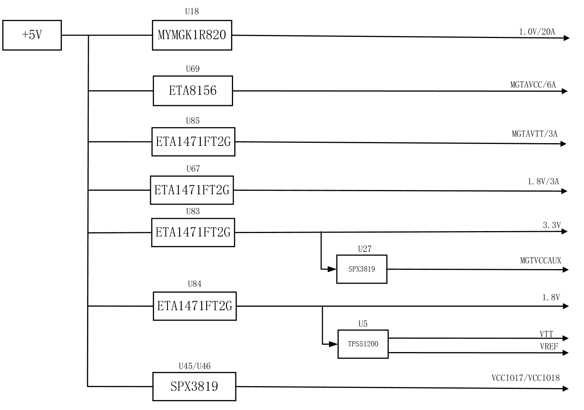
图 6：原理图中电源接口连接
**电源管理**

- **+5 V 输入**：由底板通过连接器引入至核心板电源管理模块；
- **FPGA 核心电源 +1.0 V**：通过 DCDC 升降压芯片 MYMGK1R820FRSR 生成，最大输出电流 20 A，满足 XC7K325T‑2FFG900I 核心电压需求；
- **I/O 及外设电源（+1.5 V、+3.3 V、+1.8 V、MGTAVTT）**：由 DCDC 管理芯片 ETA1471 统一产生，用于 FPGA 各 VCCIO、GTY/GTX 终端电源及混合电压域；
- **GTX 逻辑电源 +1.0 V**：通过 DCDC 芯片 ETA8156 专门为高速收发器供电；
- **GTX 辅助电源 +1.8 V**：由 LDO 稳压芯片 SPX3819‑1‑8 提供，以保证 SERDES 辅助电路稳定；
- **DDR3 VTT/VREF 电压**：由 TI TPS51200 高精度电源管理器件生成，满足 DRAM 终端电压与参考电压规范；
- **BANK17/BANK18 可调 I/O 电源**：通过两路 LDO 芯片 SPX3819M5‑3‑3 输出，用户可通过更换 LDO 实现 1.2 V/1.5 V/1.8 V/2.5 V 等多种电平兼容；
- **上电顺序**：严格按照 AMD Kintex‑7 器件电源规格要求设计，上电依次为 +1.0 V → +1.8 V → (+1.5 V、+3.3 V、VCCIO17、VCCIO18)，确保各电源域稳定且芯片功能正常。

### 结构图

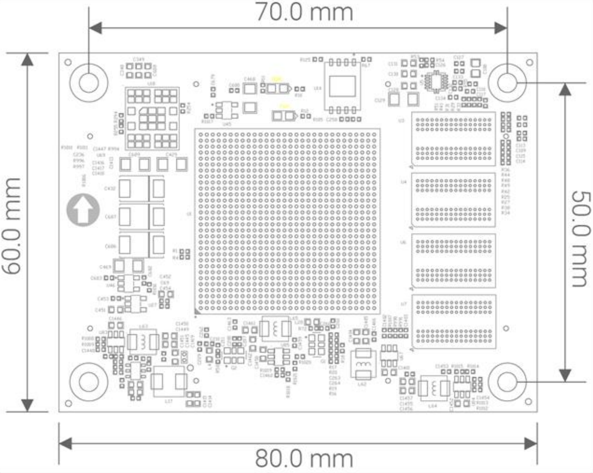
图 7：正面结构图（Top View）

### 时钟配置

核心板上为 FPGA 系统提供了两路差分有源时钟信号：

- **200 MHz 差分有源晶振**：用于驱动 FPGA 逻辑部分，包括 DDR3 控制器、用户逻辑、时钟管理模块（如 MMCM/PLL）等，为系统时序和数据同步提供稳定参考；
- **125 MHz 差分有源晶振**：专用于 GTX 高速收发器部分，作为其参考时钟输入（REFCLK），确保多通道 10.3125 Gb/s 级串行通信的稳定性、信号完整性及收发器锁相精度。

两路时钟均采用低抖动（Low Jitter）、高稳定性的差分输出时钟源，满足 AMD Kintex‑7 FPGA 对时钟质量和相位噪声的严苛要求，为整个平台的可靠运行提供坚实基础。
时钟电路设计的示意图如下图所示：

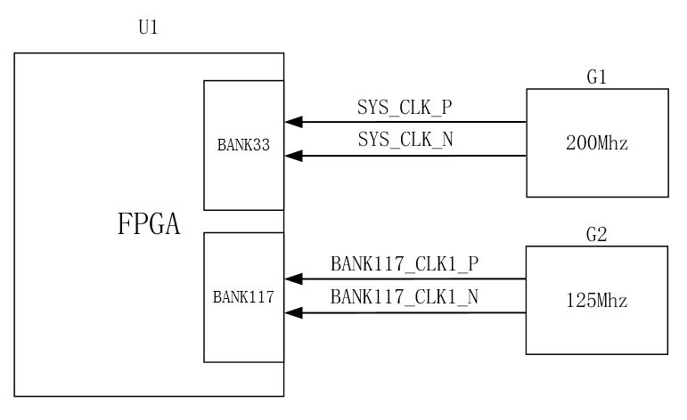
图 8：PB7K325C核心板时钟源

#### FPGA系统时钟源

板上提供了一路差分 200 MHz 的有源晶振，作为 FPGA 系统主时钟源，用于为 DDR3 控制器提供稳定的参考时钟信号。该晶振的输出为差分信号，连接至 FPGA BANK33 中的全局时钟输入引脚（MRCC，Multi-Region Clock Capable），确保时钟信号具备低抖动、高驱动能力的特点。

该 200 MHz 差分时钟不仅作为 DDR3 控制器的时钟输入，也可通过时钟管理模块（如 MMCM/PLL）在 FPGA 内部分频、倍频后分配至其他用户逻辑模块，用于实现多模块同步或异步处理场景。
下图为该差分时钟源的原理图连接示意：

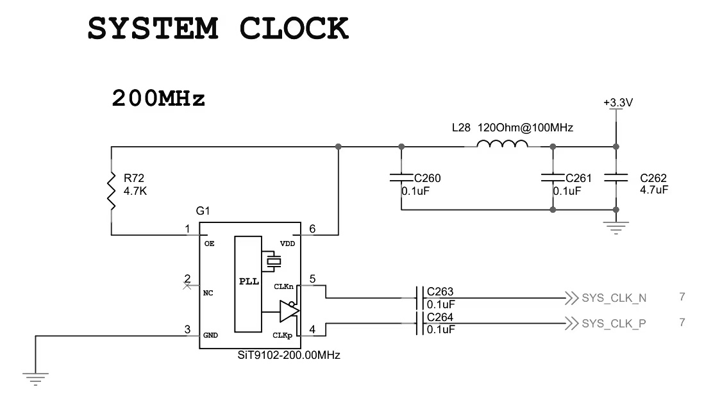
图 9：FPGA系统时钟源原理图

**FPGA系统时钟源引脚分配**

| 信号名称                      | XC7K325引脚                          |
|-----|----------|
| SYS_CLK_P                    | AE10                                |
| SYS_CLK_N                    | AF10                                |

表 1：FPGA系统时钟源引脚配置

#### GTX参考时钟源

核心板上为 FPGA 内部 GTX 高速收发器模块提供了一路 125 MHz 差分参考时钟。该时钟源输出连接至 BANK117 中的高速收发器专用参考时钟输入引脚 REFCLK1P/REFCLK1N，用于为 GTX SERDES 模块提供低抖动、高稳定性的参考时钟信号，确保 10.3125 Gb/s 等级的串行通信具备良好的抖动裕量和时钟恢复能力。

该参考时钟可被多个 GTX 通道共享，并可作为用户自定义协议、PCIe、SFP+、Aurora 等高速接口的时钟源。
下图为该 125 MHz 差分参考时钟源连接示意图：

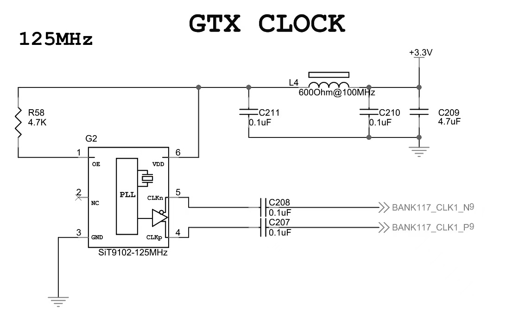
图 10：GTX参考时钟源原理图

**GTX参考时钟引脚分配**

| 信号名称                      | XC7K325引脚                          |
|-----|----------|
| BANK117_CLK1_P                    | J8                                |
| BANK117_CLK1_N                    | J7                                |

表 2：GTX参考时钟引脚配置

### PB7K325C核心板LED灯

PB7K325C 核心板上集成了 2 个红色 LED 指示灯，用于显示 FPGA 系统的电源状态与配置状态：

- **PWR（电源指示灯）**：用于指示核心板供电是否正常。当核心板接入 5V 电源且电源管理模块输出正常时，该指示灯会常亮；
- **DONE（配置完成指示灯）**：用于指示 FPGA 是否配置成功。当 QSPI Flash 或 JTAG 完成对 FPGA 的配置下载，DONE 信号由低跳变为高电平，该 LED 灯点亮，表示 FPGA 已进入用户逻辑工作状态。

两个 LED 灯均采用共阴极连接方式，低电平导通点亮，由电阻限流接入电源或控制信号。
下图为 LED 指示灯的硬件连接示意图：

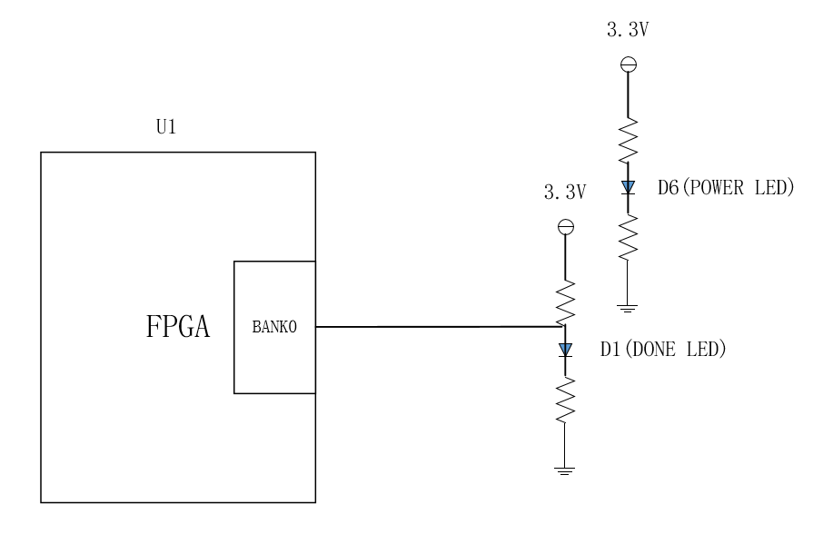
图 11：PB7K325C核心板LED原理图

### DDR3 DRAM

PB7K325C 核心板配备了四片 Micron（美光）公司的 512 MB DDR3 SDRAM 芯片，型号为 MT41K256M16HA‑125（兼容 MT41J256M16HA‑125）。每片存储芯片为 16-bit 数据宽度，4 片并联后构成总线宽度 64-bit 的 DDR3 存储系统。

该 DDR3 系统连接于 FPGA 的 HP（High Performance）高速端口，分别分布在 BANK32、BANK33、BANK34 上，支持高带宽低延迟的数据传输操作。根据 FPGA DDR3 PHY IP 支持情况，存储器的最高工作频率可达 800 MHz，即 数据传输速率 1600 Mbps（MT/s），可充分满足高清视频缓存、多通道 ISP 并行处理等大带宽应用场景。
DDR3 SDRAM 的具体配置如下表所示：

| 位号 | 芯片型号 | 容量 | 厂家 |
|-------|----------|-------|----------|
| U3,U4,U6,U7 | MT41K256M16HA-125 | 256M x 16bit | Micron |

表 3：DDR3 SDRAM参数

DDR3内存的硬件设计需要严格考虑信号完整性，以确保系统的稳定性和高效性能。在电路设计和PCB设计过程中，我们充分考虑了匹配电阻和终端电阻的选择，以减少信号反射和干扰，保证信号的传输质量。此外，我们还进行了走线阻抗控制和走线等长控制，确保DDR3数据线的阻抗一致性，减少了信号衰减和时序问题，从而提高了内存的稳定性和数据传输的可靠性。

这些设计细节确保了DDR3 SDRAM能够在高频率下稳定工作，避免了常见的信号失真和时钟抖动问题，特别是在高速数据传输时，极大地减少了潜在的系统故障风险。通过严格的设计规范和制造工艺，本系统能够支持DDR3 DRAM的高频、高速工作，确保大容量内存的可靠性和高效性能。

DDR3 DRAM的硬件连接方式如下图所示：

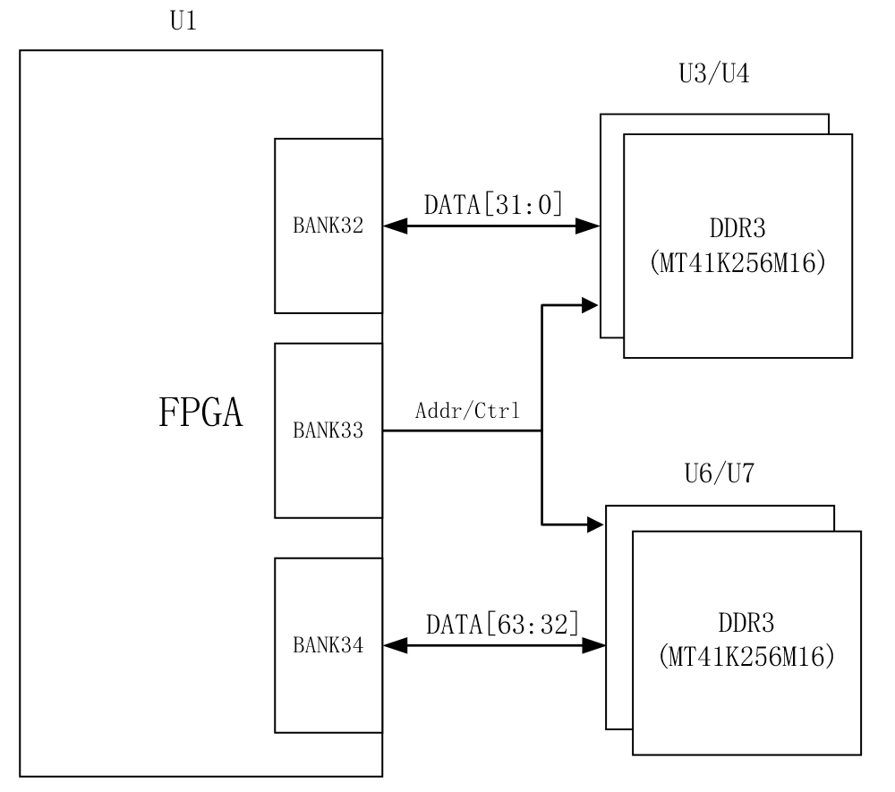
图 12：DDR3 DRAM的硬件连接

DDR3 DRAM引脚分配：

| 信号名称     | XC7K325引脚名       | XC7K325引脚号              |
|-------------|--------------------|----------------------------|
| DDR3_D0     | IO_L13P_T2_MRCC_32 | AD18                       |
| DDR3_D1     | IO_L16N_T2_32      | AB18                       |
| DDR3_D2     | IO_L14P_T2_SRCC_32 | AD17                       |
| DDR3_D3     | IO_L17P_T2_32      | AB19                       |
| DDR3_D4     | IO_L14N_T2_SRCC_32 | AD16                       |
| DDR3_D5     | IO_L17N_T2_32      | AC19                       |
| DDR3_D6     | IO_L13N_T2_MRCC_32 | AE18                       |
| DDR3_D7     | IO_L18P_T2_32      | AB17                       |
| DDR3_D8     | IO_L8P_T1_32       | AG19                       |
| DDR3_D9     | IO_L7N_T1_32       | AK19                       |
| DDR3_D10    | IO_L10P_T1_32      | AD19                       |
| DDR3_D11    | IO_L7P_T1_32       | AJ19                       |
| DDR3_D12    | IO_L11P_T1_SRCC_32 | AF18                       |
| DDR3_D13    | IO_L8N_T1_32       | AH19                       |
| DDR3_D14    | IO_L10N_T1_32      | AE19                       |
| DDR3_D15    | IO_L11N_T1_SRCC_32 | AG18                       |
| DDR3_D16    | IO_L1N_T0_32       | AK15                       |
| DDR3_D17    | IO_L5N_T0_32       | AJ17                       |
| DDR3_D18    | IO_L2N_T0_32       | AH15                       |
| DDR3_D19    | IO_L4P_T0_32       | AF15                       |
| DDR3_D20    | IO_L4N_T0_32       | AG14                       |
| DDR3_D21    | IO_L5P_T0_32       | AH17                       |
| DDR3_D22    | IO_L2P_T0_32       | AG15                       |
| DDR3_D23    | IO_L1P_T0_32       | AK16                       |
| DDR3_D24    | IO_L19P_T3_32      | AE15                       |
| DDR3_D25    | IO_L24P_T3_32      | Y16                        |
| DDR3_D26    | IO_L22P_T3_32      | AC14                       |
| DDR3_D27    | IO_L20P_T3_32      | AA15                       |
| DDR3_D28    | IO_L23P_T3_32      | AA17                       |
| DDR3_D29    | IO_L22N_T3_32      | AD14                       |
| DDR3_D30    | IO_L23N_T3_32      | AA16                       |
| DDR3_D31    | IO_L20N_T3_32      | AB15                       |
| DDR3_D32    | IO_L22N_T3_34      | AK6                        |
| DDR3_D33    | IO_L23P_T3_34      | AJ8                        |
| DDR3_D34    | IO_L22P_T3_34      | AJ6                        |
| DDR3_D35    | IO_L19P_T3_34      | AF8                        |
| DDR3_D36    | IO_L24N_T3_34      | AK4                        |
| DDR3_D37    | IO_L23N_T3_34      | AK8                        |
| DDR3_D38    | IO_L24P_T3_34      | AK5                        |
| DDR3_D39    | IO_L20N_T3_34      | AG7                        |
| DDR3_D40    | IO_L10P_T1_34      | AE4                        |
| DDR3_D41    | IO_L8N_T1_34       | AF1                        |
| DDR3_D42    | IO_L11P_T1_SRCC_34 | AE5                        |
| DDR3_D43    | IO_L8P_T1_34       | AE1                        |
| DDR3_D44    | IO_L12P_T1_MRCC_34 | AF6                        |
| DDR3_D45    | IO_L10N_T1_34      | AE3                        |
| DDR3_D46    | IO_L11N_T1_SRCC_34 | AF5                        |
| DDR3_D47    | IO_L7N_T1_34       | AF2                        |
| DDR3_D48    | IO_L13P_T2_MRCC_34 | AH4                        |
| DDR3_D49    | IO_L16N_T2_34      | AJ2                        |
| DDR3_D50    | IO_L14N_T2_SRCC_34 | AH5                        |
| DDR3_D51    | IO_L13N_T2_MRCC_34 | AJ4                        |
| DDR3_D52    | IO_L16P_T2_34      | AH2                        |
| DDR3_D53    | IO_L17N_T2_34      | AK1                        |
| DDR3_D54    | IO_L14P_T2_SRCC_34 | AH6                        |
| DDR3_D55    | IO_L17P_T2_34      | AJ1                        |
| DDR3_D56    | IO_L2P_T0_34       | AC2                        |
| DDR3_D57    | IO_L4P_T0_34       | AC5                        |
| DDR3_D58    | IO_L1N_T0_34       | AD3                        |
| DDR3_D59    | IO_L6P_T0_34       | AC7                        |
| DDR3_D60    | IO_L5N_T0_34       | AE6                        |
| DDR3_D61    | IO_L5P_T0_34       | AD6                        |
| DDR3_D62    | IO_L2N_T0_34       | AC1                        |
| DDR3_D63    | IO_L4N_T0_34       | AC4                        |
| DDR3_DM0    | IO_L16P_T2_32      | AA18                       |
| DDR3_DM1    | IO_L12P_T1_MRCC_32 | AF17                       |
| DDR3_DM2    | IO_L6P_T0_32       | AE16                       |
| DDR3_DM3    | IO_L24N_T3_32      | Y15                        |
| DDR3_DM4    | IO_L20P_T3_34      | AF7                        |
| DDR3_DM5    | IO_L7P_T1_34       | AF3                        |
| DDR3_DM6    | IO_L18P_T2_34      | AJ3                        |
| DDR3_DM7    | IO_L1P_T0_34       | AD4                        |
| DDR3_DQS0_P | IO_L15P_T2_DQS_32  | Y19                        |
| DDR3_DQS0_N | IO_L15N_T2_DQS_32  | Y18                        |
| DDR3_DQS1_P | IO_L9P_T1_DQS_32   | AJ18                       |
| DDR3_DQS1_N | IO_L9N_T1_DQS_32   | AK18                       |
| DDR3_DQS2_P | IO_L3P_T0_DQS_32   | AH16                       |
| DDR3_DQS2_N | IO_L3N_T0_DQS_32   | AJ16                       |
| DDR3_DQS3_P | IO_L21P_T3_DQS_32  | AC16                       |
| DDR3_DQS3_N | IO_L21N_T3_DQS_32  | AC15                       |
| DDR3_DQS4_P | IO_L21P_T3_DQS_34  | AH7                        |
| DDR3_DQS4_N | IO_L21N_T3_DQS_34  | AJ7                        |
| DDR3_DQS5_P | IO_L9P_T1_DQS_34   | AG4                        |
| DDR3_DQS5_N | IO_L9N_T1_DQS_34   | AG3                        |
| DDR3_DQS6_P | IO_L15P_T2_DQS_34  | AG2                        |
| DDR3_DQS6_N | IO_L15N_T2_DQS_34  | AH1                        |
| DDR3_DQS7_P | IO_L3P_T0_DQS_34   | AD2                        |
| DDR3_DQS7_N | IO_L3N_T0_DQS_34   | AD1                        |
| DDR3_A0     | IO_L1P_T0_33       | AA12                       |
| DDR3_A1     | IO_L1N_T0_33       | AB12                       |
| DDR3_A2     | IO_L2P_T0_33       | AA8                        |
| DDR3_A3     | IO_L2N_T0_33       | AB8                        |
| DDR3_A4     | IO_L3P_T0_DQS_33   | AB9                        |
| DDR3_A5     | IO_L3N_T0_DQS_33   | AC9                        |
| DDR3_A6     | IO_L6N_T0_VREF_33  | AB13                       |
| DDR3_A7     | IO_L4N_T0_33       | Y10                        |
| DDR3_A8     | IO_L5P_T0_33       | AA11                       |
| DDR3_A9     | IO_L5N_T0_33       | AA10                       |
| DDR3_A10    | IO_L6P_T0_33       | AA13                       |
| DDR3_A11    | IO_L8P_T1_33       | AD8                        |
| DDR3_A12    | IO_L7P_T1_33       | AB10                       |
| DDR3_A13    | IO_L7N_T1_33       | AC10                       |
| DDR3_A14    | IO_L15P_T2_DQS_33  | AJ9                        |
| DDR3_BA0    | IO_L8N_T1_33       | AE8                        |
| DDR3_BA1    | IO_L9P_T1_DQS_33   | AC12                       |
| DDR3_BA2    | IO_L9N_T1_DQS_33   | AC11                       |
| DDR3_WE     | IO_L10P_T1_33      | AD9                        |
| DDR3_RAS    | IO_L10N_T1_33      | AE9                        |
| DDR3_CAS    | IO_L11P_T1_SRCC_33 | AE11                       |
| DDR3_S0     | IO_L11N_T1_SRCC_33 | AF11                       |
| DDR3_CKE0   | IO_L12P_T1_MRCC_33 | AD12                       |
| DDR3_ODT    | IO_L12N_T1_MRCC_33 | AD11                       |
| DDR3_CLK0_P | IO_L13P_T2_MRCC_33 | AG10                       |
| DDR3_CLK0_N | IO_L13N_T2_MRCC_33 | AH10                       |
| DDR3_RESET  | IO_L4P_T0_33       | Y11                        |

表 4：DDR3 DRAM引脚分配

### QSPI Flash

核心板配有一片 128MBit 大小的 Quad-SPI FLASH 芯片，型号为 N25Q128A，它使用 3.3V CMOS 电压标准。由于 QSPI FLASH 的非易失特性，在使用中， 它可以存储 FPGA 的配置 Bin 文件以及其它的用户数据文件。

该芯片的具体型号和相关参数如下表所示：

| 位号 | 芯片类型 | 容量 | 厂家 |
|-----|----------|-------|----------|
| U14 | N25Q128A | 128Mbit | Numonyx |

表 5：QSPI FLASH参数
QSPI FLASH 连接到 FPGA 芯片的 BANK0 和 BANK14 的专用管脚上，其中时钟管脚连接到 BANK0 的 CCLK0 上，其它数据和片选信号分别连接到 BANK14 的 D00~D03 和FCS 管脚上。

在硬件设计中，GPIO口的功能配置需要与QSPI FLASH的引脚对应起来，确保数据传输的稳定性和高效性。此外，还需要考虑信号完整性、时序要求和电源管理，以保证QSPI FLASH在高频操作时的稳定性。通过合理的电路布局和精准的信号控制，确保QSPI接口能够发挥其最大性能。

下图展示了QSPI FLASH在原理图中的部分连接示意：

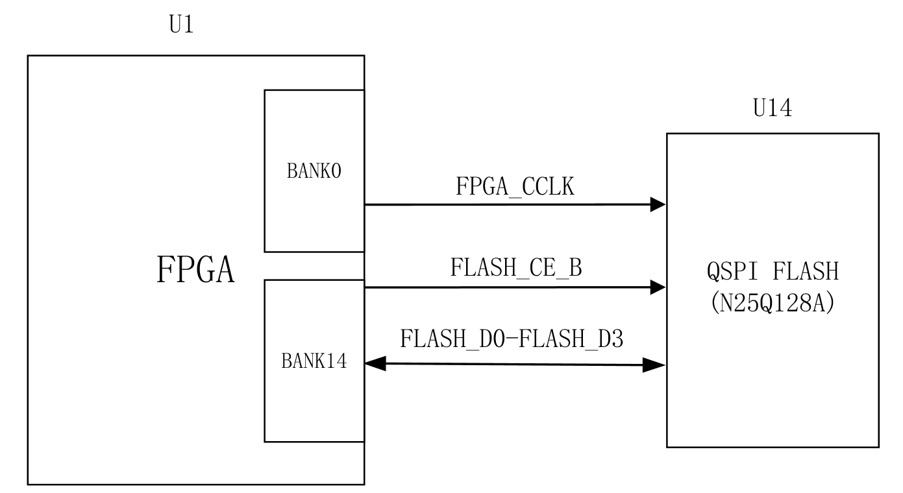
图 13：QSPI FLASH连接示意图

配置芯片引脚分配：

| 信号名称 | XC7K325引脚名 | XC7K325引脚号 |
|-----------|----------------------|----|
|FPGA_CCLK  |CCLK_0                |B10 |
|FLASH_CE_B |IO_L6P_T0_FCS_B_14    |U19 |
|FLASH_D0   |IO_L1P_T0_D00_MOSI_14 |P24 |
|FLASH_D1   |IO_L1N_T0_D01_DIN_14  |R25 |
|FLASH_D2   |IO_L2P_T0_D02_14      |R20 |
|FLASH_D3   |IO_L2N_T0_D03_14      |R21 |

表 6：QSPI FLASH引脚配置

### 连接器管脚定义

核心板共扩展出 4 个高速板对板连接口，采用 4 个 120Pin 松下连接器 AXK5A2137YG（J29 ~ J32），与底板对应连接器 AXK6A2337YG 配对使用。这些高速连接器用于承载高速信号、用户 I/O、电源和调试接口等关键信号通道，确保核心板与底板之间的数据传输高速、稳定、低干扰。具体连接关系如下所示：

- **J29**：主要连接 FPGA 的 GTX 高速收发器信号通道，用于支持高速串行通信接口（如 SFP+、Aurora、PCIe 等），保证每对差分信号具有良好的阻抗匹配与走线对称性；
- **J30**：连接 FPGA 的 JTAG 调试口以及 BANK17 和 BANK18 的用户 I/O 引脚，其中 BANK17/BANK18 的 I/O 电压可通过更换核心板 LDO 芯片配置（支持多电平标准，如 1.2V / 1.5V / 1.8V / 2.5V）；
- **J31**：连接 FPGA 的 BANK15 全部 I/O 信号通道，支持通用 LVTTL、LVCMOS、差分对等外设扩展信号；
- **J32**：连接 FPGA 的 BANK12 和 BANK13 的 I/O 信号及系统 +5 V 电源输入端口，同时供电电源也通过此接口从底板传输至核心板，确保所有电源轨稳定供能。

该设计充分考虑了高速信号隔离、电源分区及功能模块独立分布，具备良好的可扩展性与二次开发便利性，适用于多种高性能系统级 FPGA 应用场景。

#### J29连接器的引脚分配

| J29管脚  | 信号名称  | XC7K325引脚号   | J29管脚   | 信号名称  | XC7K325引脚号   |
|-----|--------------------|----|-----|----------------|-----|
| 1   | BANK115_TX0_N      | Y1 | 2   | BANK115_RX0_N  | AA3 |
| 3   | BANK115_TX0_P      | Y2 | 4   | BANK115_RX0_P  | AA4 |
| 5   | GND                | -  | 6   | GND            |   - |
| 7   | BANK115_TX1_N      | V1 | 8   | BANK115_RX1_N  | Y5  |
| 9   | BANK115_TX1_P      | V2 | 10  | BANK115_RX1_P  | Y6  |
| 11  | GND                | -  | 12  | GND            |   - |
| 13  | BANK115_TX2_N      | U3 | 14  | BANK115_RX2_N  | W3  |
| 15  | BANK115_TX2_P      | U4 | 16  | BANK115_RX2_P  | W4  |
| 17  | GND                | -  | 18  | GND            |   - |
| 19  | BANK115_TX3_N      | T1 | 20  | BANK115_RX3_N  | V5  |
| 21  | BANK115_TX3_P      | T2 | 22  | BANK115_RX3_P  | V6  |
| 23  | GND                | -  | 24  | GND            |  -  |
| 25  | BANK115_CLK0_N     | R7 | 26  | BANK115_CLK1_N | U7  |
| 27  | BANK115_CLK0_P     | R8 | 28  | BANK115_CLK1_P | U8  |
| 29  | GND                | -  | 30  | GND            |  -  |
| 31  | BANK116_TX0_N      | P1 | 32  | BANK116_RX0_N  | T5  |
| 33  | BANK116_TX0_P      | P2 | 34  | BANK116_RX0_P  | T6  |
| 35  | GND                | -  | 36  | GND            |   - |
| 37  | BANK116_TX1_N      | N3 | 38  | BANK116_RX1_N  | R3  |
| 39  | BANK116_TX1_P      | N4 | 40  | BANK116_RX1_P  | R4  |
| 41  | GND                | -  | 42  | GND            |   - |
| 43  | BANK116_TX2_N      | M1 | 44  | BANK116_RX2_N  | P5  |
| 45  | BANK116_TX2_P      | M2 | 46  | BANK116_RX2_P  | P6  |
| 47  | GND                | -  | 48  | GND            |   - |
| 49  | BANK116_TX3_N      | L3 | 50  | BANK116_RX3_N  | M5  |
| 51  | BANK116_TX3_P      | L4 | 52  | BANK116_RX3_P  | M6  |
| 53  | GND                | -  | 54  | GND            |  -  |
| 55  | BANK116_CLK0_N     | L7 | 56  | BANK116_CLK1_N | N7  |
| 57  | BANK116_CLK0_P     | L8 | 58  | BANK116_CLK1_P | N8  |
| 59  | GND                | -  | 60  | GND            |  -  |
| 61  | BANK117_TX0_N      | K1 | 62  | BANK118_TX0_N  | D1  |
| 63  | BANK117_TX0_P      | K2 | 64  | BANK118_TX0_P  | D2  |
| 65  | GND                | -  | 66  | GND            |   - |
| 67  | BANK117_RX0_N      | K5 | 68  | BANK118_RX0_N  | E3  |
| 69  | BANK117_RX0_P      | K6 | 70  | BANK118_RX0_P  | E4  |
| 71  | GND                | -  | 72  | GND            |   - |
| 73  | BANK117_TX1_N      | J3 | 74  | BANK118_TX1_N  | C3  |
| 75  | BANK117_TX1_P      | J4 | 76  | BANK118_TX1_P  | C4  |
| 77  | GND                | -  | 78  | GND            |   - |
| 79  | BANK117_RX1_N      | H5 | 80  | BANK118_RX1_N  | D5  |
| 81  | BANK117_RX1_P      | H6 | 82  | BANK118_RX1_P  | D6  |
| 83  | GND                | -  | 84  | GND            |   - |
| 85  | BANK117_TX2_N      | H1 | 86  | BANK118_TX2_N  | B1  |
| 87  | BANK117_TX2_P      | H2 | 88  | BANK118_TX2_P  | B2  |
| 89  | GND                | -  | 90  | GND            |   - |
| 91  | BANK117_RX2_N      | G3 | 92  | BANK118_RX2_N  | B5  |
| 93  | BANK117_RX2_P      | G4 | 94  | BANK118_RX2_P  | B6  |
| 95  | GND                | -  | 96  | GND            |   - |
| 97  | BANK117_TX3_N      | F1 | 98  | BANK118_TX3_N  | A3  |
| 99  | BANK117_TX3_P      | F2 | 100 | BANK118_TX3_P  | A4  |
| 101 | GND                | -  | 102 | GND            |   - |
| 103 | BANK117_RX3_N      | F5 | 104 | BANK118_RX3_N  | A7  |
| 105 | BANK117_RX3_P      | F6 | 106 | BANK118_RX3_P  | A8  |
| 107 | GND                | -  | 108 | GND            |  -  |
| 109 | BANK117_CLK0_N     | G7 | 110 | BANK118_CLK0_N | C7  |
| 111 | BANK117_CLK0_P     | G8 | 112 | BANK118_CLK0_P | C8  |
| 113 | GND                | -  | 114 | GND            |  -  |
| 115 |                    |    | 116 | BANK118_CLK1_N | E7  |
| 117 |                    |    | 118 | BANK118_CLK1_P | E8  |
| 119 | GND                | -  | 120 | GND            |  -  |

表 7：J29连接器的引脚配置

#### J30连接器的引脚分配

| J30管脚 | 信号名称 | XC7K325引脚号 | J30管脚 | 信号名称 | XC7K325引脚号 |
|-----|----------|-------|-----|----------|-------|
| 1   | B18_L5_P   | K14  | 2   | B18_L3_P   | L12  |
| 3   | B18_L5_N   | J14  | 4   | B18_L3_N   | L13  |
| 5   | B18_L6_P   | L11  | 6   | B18_L2_P   | L15  |
| 7   | B18_L6_N   | K11  | 8   | B18_L2_N   | K15  |
| 9   | GND        |  -   | 10  | GND        | -    |
| 11  | B18_L7_P   | H15  | 12  | B18_L1_P   | L16  |
| 13  | B18_L7_N   | G15  | 14  | B18_L1_N   | K16  |
| 15  | B18_L8_P   | J11  | 16  | B18_L4_P   | K13  |
| 17  | B18_L8_N   | J12  | 18  | B18_L4_N   | J13  |
| 19  | GND        |  -   | 20  | GND        | -    |
| 21  | B18_L9_P   | J16  | 22  | B18_L12_P  | G13  |
| 23  | B18_L9_N   | H16  | 24  | B18_L12_N  | F13  |
| 25  | B18_L16_P  | F11  | 26  | B18_L10_P  | H11  |
| 27  | B18_L16_N  | E11  | 28  | B18_L10_N  | H12  |
| 29  | GND        | -    | 30  | GND        | -    |
| 31  | B18_L18_P  | D11  | 32  | B18_L20_P  | E14  |
| 33  | B18_L18_N  | C11  | 34  | B18_L20_N  | E15  |
| 35  | B18_L15_P  | C12  | 36  | B18_L11_P  | H14  |
| 37  | B18_L15_N  | B12  | 38  | B18_L11_N  | G14  |
| 39  | GND        | -    | 40  | GND        | -    |
| 41  | B18_L23_P  | C15  | 42  | B18_L21_P  | D14  |
| 43  | B18_L23_N  | B15  | 44  | B18_L21_N  | C14  |
| 45  | B18_L17_P  | A11  | 46  | B18_L22_P  | B13  |
| 47  | B18_L17_N  | A12  | 48  | B18_L22_N  | A13  |
| 49  | GND        | -    | 50  | GND        | -    |
| 51  | B18_L24_P  | B14  | 52  | B17_L5_N   | L18  |
| 53  | B18_L24_N  | A15  | 54  | B17_L5_P   | L17  |
| 55  | B18_L19_P  | F15  | 56  | B17_L15_P  | D16  |
| 57  | B18_L19_N  | E16  | 58  | B17_L15_N  | C16  |
| 59  | GND        | -    | 60  | GND        | -    |
| 61  | B17_L17_P  | C17  | 62  | B17_L14_P  | E19  |
| 63  | B17_L17_N  | B17  | 64  | B17_L14_N  | D19  |
| 65  | B17_L1_P   | K18  | 66  | B17_L20_P  | A16  |
| 67  | B17_L1_N   | J18  | 68  | B17_L20_N  | A17  |
| 69  | GND        | -    | 70  | GND        | -    |
| 71  | B17_L22_N  | A18  | 72  | B17_L21_P  | A20  |
| 73  | B17_L22_P  | B18  | 74  | B17_L21_N  | A21  |
| 75  | B17_L8_P   | D21  | 76  | B17_L13_P  | D17  |
| 77  | B17_L8_N   | C21  | 78  | B17_L13_N  | D18  |
| 79  | GND        | -    | 80  | GND        | -    |
| 81  | B17_L24_P  | C19  | 82  | B17_L23_N  | A22  |
| 83  | B17_L24_N  | B19  | 84  | B17_L23_P  | B22  |
| 85  | B17_L18_N  | F17  | 86  | B17_L12_P  | F20  |
| 87  | B17_L18_P  | G17  | 88  | B17_L12_N  | E20  |
| 89  | GND        | -    | 90  | GND        | -    |
| 91  | B17_L19_N  | B20  | 92  | B17_L11_N  | E21  |
| 93  | B17_L19_P  | C20  | 94  | B17_L11_P  | F21  |
| 95  | B17_L10_N  | C22  | 96  | B17_L9_N   | F22  |
| 97  | B17_L10_P  | D22  | 98  | B17_L9_P   | G22  |
| 99  | GND        | -    | 100 | GND        | -    |
| 101 | B17_L16_N  | F18  | 102 | B17_L7_P   | H21  |
| 103 | B17_L16_P  | G18  | 104 | B17_L7_N   | H22  |
| 105 | B17_L2_N   | G20  | 106 | B17_L3_N   | H17  |
| 107 | B17_L2_P   | H20  | 108 | B17_L3_P   | J17  |
| 109 | GND        | -    | 110 | GND        | -    |
| 111 | B17_L4_N   | H19  | 112 | FPGA_TCK   | E10  |
| 113 | B17_L4_P   | J19  | 114 | FPGA_TMS   | F10  |
| 115 | B17_L6_P   | K19  | 116 | FPGA_TDO   | G10  |
| 117 | B17_L6_N   | K20  | 118 | FPGA_TDI   | H10  |
| 119 | GND        |  -   | 120 | GND        | -    |

表 8：J30连接器的引脚配置

#### J31连接器的引脚分配

| J31管脚 | 信号名称 | XC7K325引脚号 | J31管脚 | 信号名称 | XC7K325引脚号 |
|-----|----------|-------|-----|----------|-------|
| 1   | B16_L12_N  | B25  | 2   | B16_L8_P   | C24  |
| 3   | B16_L12_P  | C25  | 4   | B16_L8_N   | B24  |
| 5   | B16_L10_N  | A26  | 6   | B16_L16_N  | C30  |
| 7   | B16_L10_P  | A25  | 8   | B16_L16_P  | D29  |
| 9   | GND        | -    | 10  | GND        | -    |
| 11  | B16_L11_N  | C26  | 12  | B16_L7_N   | A27  |
| 13  | B16_L11_P  | D26  | 14  | B16_L7_P   | B27  |
| 15  | B16_L13_N  | C27  | 16  | B16_L18_N  | E30  |
| 17  | B16_L13_P  | D27  | 18  | B16_L18_P  | E29  |
| 19  | GND        | -    | 20  | GND        | -    |
| 21  | B16_L21_P  | G27  | 22  | B16_L14_N  | D28  |
| 23  | B16_L21_N  | F27  | 24  | B16_L14_P  | E28  |
| 25  | B16_L20_N  | F28  | 26  | B16_L22_N  | F30  |
| 27  | B16_L20_P  | G28  | 28  | B16_L22_P  | G29  |
| 29  | GND        | -    | 30  | GND        | -    |
| 31  | B16_L9_P   | B28  | 32  | B16_L5_P   | F26  |
| 33  | B16_L9_N   | A28  | 34  | B16_L5_N   | E26  |
| 35  | B16_L15_P  | C29  | 36  | B16_L24_N  | G30  |
| 37  | B16_L15_N  | B29  | 38  | B16_L24_P  | H30  |
| 39  | GND        | -    | 40  | GND        | -    |
| 41  | B16_L19_N  | H25  | 42  | B16_L23_N  | H27  |
| 43  | B16_L19_P  | H24  | 44  | B16_L23_P  | H26  |
| 45  | B16_L1_N   | A23  | 46  | B16_L17_P  | B30  |
| 47  | B16_L1_P   | B23  | 48  | B16_L17_N  | A30  |
| 49  | GND        | -    | 50  | GND        | -    |
| 51  | B16_L2_P   | E23  | 52  | B16_L3_N   | E25  |
| 53  | B16_L2_N   | D23  | 54  | B16_L3_P   | F25  |
| 55  | B16_L6_N   | G24  | 56  | B16_L4_P   | E24  |
| 57  | B16_L6_P   | G23  | 58  | B16_L4_N   | D24  |
| 59  | GND        | -    | 60  | GND        | -    |
| 61  | B15_L14_N  | L28  | 62  | B15_L7_N   | H29  |
| 63  | B15_L14_P  | M28  | 64  | B15_L7_P   | J29  |
| 65  | B15_L10_N  | J26  | 66  | B15_L8_N   | J28  |
| 67  | B15_L10_P  | K26  | 68  | B15_L8_P   | J27  |
| 69  | GND        | -    | 70  | GND        | -    |
| 71  | B15_L1_N   | J24  | 72  | B15_L24_N  | M23  |
| 73  | B15_L1_P   | J23  | 74  | B15_L24_P  | M22  |
| 75  | B15_L18_N  | N26  | 76  | B15_L3_N   | K24  |
| 77  | B15_L18_P  | N25  | 78  | B15_L3_P   | K23  |
| 79  | GND        | -    | 80  | GND        | -    |
| 81  | B15_L2_N   | L23  | 82  | B15_L21_N  | N24  |
| 83  | B15_L2_P   | L22  | 84  | B15_L21_P  | P23  |
| 85  | B15_L13_P  | K28  | 86  | B15_L12_N  | K25  |
| 87  | B15_L13_N  | K29  | 88  | B15_L12_P  | L25  |
| 89  | GND        | -    | 90  | GND        | -    |
| 91  | B15_L22_N  | P22  | 92  | B15_L20_N  | N22  |
| 93  | B15_L22_P  | P21  | 94  | B15_L20_P  | N21  |
| 95  | B15_L15_N  | M30  | 96  | B15_L9_N   | K30  |
| 97  | B15_L15_P  | M29  | 98  | B15_L9_P   | L30  |
| 99  | GND        | -    | 100 | GND        | -    |
| 101 | B15_L19_N  | N20  | 102 | B15_L5_N   | J22  |
| 103 | B15_L19_P  | N19  | 104 | B15_L5_P   | J21  |
| 105 | B15_L17_N  | N30  | 106 | B15_L6_N   | L20  |
| 107 | B15_L17_P  | N29  | 108 | B15_L6_P   | M20  |
| 109 | GND        | -    | 110 | GND        | -    |
| 111 | B15_L11_N  | L27  | 112 | B15_L16_N  | M27  |
| 113 | B15_L11_P  | L26  | 114 | B15_L16_P  | N27  |
| 115 | B15_L23_N  | M25  | 116 | B15_L4_P   | L21  |
| 117 | B15_L23_P  | M24  | 118 | B15_L4_N   | K21  |
| 119 | GND        | -    | 120 | GND        | -    |

表 9：J31连接器的引脚配置

#### J32连接器的引脚分配

| J32管脚 | 信号名称 | XC7K325引脚号 | J32管脚 | 信号名称 | XC7K325引脚号 |
|-----|----------|-------|-----|----------|-------|
| 1   | B13_L16_P  | AE30 | 2   | B13_L10_N  | AB30 |
| 3   | B13_L16_N  | AF30 | 4   | B13_L10_P  | AB29 |
| 5   | B13_L23_N  | AF27 | 6   | B13_L9_P   | AD29 |
| 7   | B13_L23_P  | AF26 | 8   | B13_L9_N   | AE29 |
| 9   | GND        | U14  | 10  | GND        | U14  |  
| 11  | B13_L14_P  | AE28 | 12  | B13_L6_P   | AA25 |
| 13  | B13_L14_N  | AF28 | 14  | B13_L6_N   | AB25 |
| 15  | B13_L13_P  | AG29 | 16  | B13_L5_N   | AB28 |
| 17  | B13_L13_N  | AH29 | 18  | B13_L5_P   | AA27 |
| 19  | GND        | U14  | 20  | GND        | U14  |  
| 21  | B13_L18_P  | AG30 | 22  | B13_L2_N   | W28  |  
| 23  | B13_L18_N  | AH30 | 24  | B13_L2_P   | W27  |  
| 25  | B13_L21_N  | AG28 | 26  | B13_L8_P   | Y30  |  
| 27  | B13_L21_P  | AG27 | 28  | B13_L8_N   | AA30 |
| 29  | GND        | U14  | 30  | GND        | U14  |  
| 31  | B13_L15_N  | AK30 | 32  | B13_L11_N  | AD28 |
| 33  | B13_L15_P  | AK29 | 34  | B13_L11_P  | AD27 |
| 35  | B13_L17_N  | AJ29 | 36  | B13_L7_N   | AC30 |
| 37  | B13_L17_P  | AJ28 | 38  | B13_L7_P   | AC29 |
| 39  | GND        | U14  | 40  | GND        | U14  |  
| 41  | B13_L20_N  | AK28 | 42  | B13_L12_N  | AC27 |
| 43  | B13_L20_P  | AJ27 | 44  | B13_L12_P  | AB27 |
| 45  | B13_L22_N  | AH27 | 46  | B13_L1_P   | Y26  |  
| 47  | B13_L22_P  | AH26 | 48  | B13_L1_N   | AA26 |
| 49  | GND        | U14  | 50  | GND        | U14  |  
| 51  | B13_L24_N  | AK26 | 52  | B13_L4_N   | Y29  |  
| 53  | B13_L24_P  | AJ26 | 54  | B13_L4_P   | W29  |  
| 55  | B13_L19_N  | AD26 | 56  | B13_L3_N   | AA28 |
| 57  | B13_L19_P  | AC26 | 58  | B13_L3_P   | Y28  |  
| 59  | GND        | U14  | 60  | GND        | U14  |  
| 61  | B12_L12_P  | AD23 | 62  | B12_L9_N   | AD24 |
| 63  | B12_L12_N  | AE24 | 64  | B12_L9_P   | AC24 |
| 65  | B12_L16_P  | AE25 | 66  | B12_L8_N   | AD22 |
| 67  | B12_L16_N  | AF25 | 68  | B12_L8_P   | AC22 |
| 69  | GND        | U14  | 70  | GND        | U14  |  
| 71  | B12_L13_P  | AF22 | 72  | B12_L7_N   | AC25 |
| 73  | B12_L13_N  | AG23 | 74  | B12_L7_P   | AB24 |
| 75  | B12_L18_P  | AG25 | 76  | B12_L4_N   | AA23 |
| 77  | B12_L18_N  | AH25 | 78  | B12_L4_P   | AA22 |
| 79  | GND        | U14  | 80  | GND        | U14  |  
| 81  | B12_L15_N  | AK25 | 82  | B12_L1_P   | Y23  |  
| 83  | B12_L15_P  | AJ24 | 84  | B12_L1_N   | Y24  |  
| 85  | B12_L17_N  | AK24 | 86  | B12_L2_P   | Y21  |  
| 87  | B12_L17_P  | AK23 | 88  | B12_L2_N   | AA21 |
| 89  | GND        | U14  | 90  | GND        | U14  |  
| 91  | B12_L14_N  | AH24 | 92  | B12_L6_P   | AA20 |
| 93  | B12_L14_P  | AG24 | 94  | B12_L6_N   | AB20 |
| 95  | B12_L20_N  | AH22 | 96  | B12_L10_N  | AE21 |
| 97  | B12_L20_P  | AG22 | 98  | B12_L10_P  | AD21 |
| 99  | GND        | U14  | 100 | GND        | U14  |  
| 101 | B12_L19_N  | AF21 | 102 | B12_L3_P   | AB22 |
| 103 | B12_L19_P  | AF20 | 104 | B12_L3_N   | AB23 |
| 105 | B12_L11_N  | AF23 | 106 | B12_L5_P   | AC20 |
| 107 | B12_L11_P  | AE23 | 108 | B12_L5_N   | AC21 |
| 109 | GND        | -    | 110 | GND        | -    |
| 111 | +5V        | -    | 112 | +5V        | -    |
| 113 | +5V        | -    | 114 | +5V        | -    |
| 115 | +5V        | -    | 116 | +5V        | -    |
| 117 | +5V        | -    | 118 | +5V        | -    |
| 119 | +5V        | -    | 120 | +5V        | -    |

表 10：J32连接器的引脚配置

## PB7K325扩展板简介

通过前面的功能简介，我们可以了解到 扩展板 的整体功能布局与设计目标如下：

扩展板作为 PB7K325C 核心板的配套底板，主要通过 4 个高速板间连接器与核心板相连，扩展了丰富的外围接口与功能模块，便于用户快速构建完整的 FPGA 应用系统平台。其主要功能包括：

- 提供 **HDMI 视频输入与输出接口**，支持高分辨率视频采集与显示，便于图像算法验证与演示；
- 搭载 **6G SDI 接口** 与 **GMSL 视频输入接口**，适配广播级及工业级摄像头信号；
- 提供 **SFP+ 光纤接口** 与 **M.2 NVMe SSD 接口**，构建高带宽数据传输与存储通道；
- 提供 **RS-485、CAN、UART 等工业通信接口**，满足工业现场控制与调试需求；
- 支持 **双路千兆以太网 RJ45** 和 **双路万兆光纤 SFP+ 接口**，实现远程数据交换与高速通信；
- 提供 **JTAG 下载口、40Pin 用户扩展口与按键/LED 指示灯**，增强系统可调试性与交互性；
- 提供来自底板的 **DC 5V 电源输入**，统一为核心板各电源轨供能。

扩展板以丰富、实用的外设资源与高速接口为核心板提供了强大的系统级功能支持，是面向视频处理、图像识别、通信加速等多类应用场景的高性能、模块化硬件平台

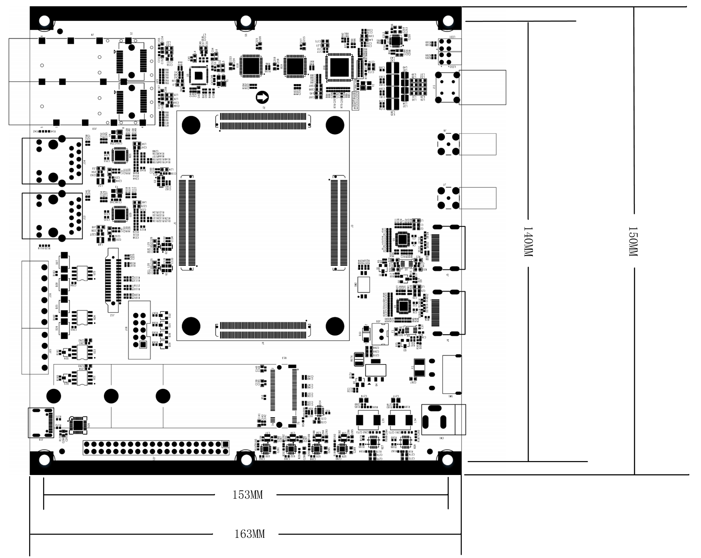
图 14：PB7K325扩展板正面结构尺寸图(Top View)

### 电源设计

开发板的电源输入电压为 DC 12 V，由扩展底板统一引入。底板通过板载 6 路高效 DC/DC 电源转换电路，分别生成供整个平台使用的多个电压轨，满足 FPGA 核心板及外围电路的多种电压需求。具体电源设计如下：

- **+5 V / 6 A**：由 **TPS54620** 降压芯片产生，作为主电源轨，通过板间连接器供电至 PB7K325C 核心板，为 FPGA 内核、DDR3、Flash 及其电源模块提供能量支撑；
- **+3.3 V / 6 A**：由另一颗 **TPS54620** 生成，主要用于扩展接口、电平转换芯片、以太网等外设模块供电；
- **+1.8 V / 3 A、+1.2 V / 3 A、+2.5 V / 3 A、辅助 +3.3 V / 3 A**：均由 **TLV62130** 高效率 DC/DC 转换器分别独立供出，满足 DDR3 VREF/VTT、视频接口、调试电路、I/O 电压域等电路的功耗需求。

由于 +5 V 是从底板供电至核心板的主电源轨，因此特意将该通道电流能力设定为 6 A，确保在全速运行、高负载算法或视频接口并发情况下仍具有充足的电流裕量。
下图为板载电源系统的拓扑结构示意图：

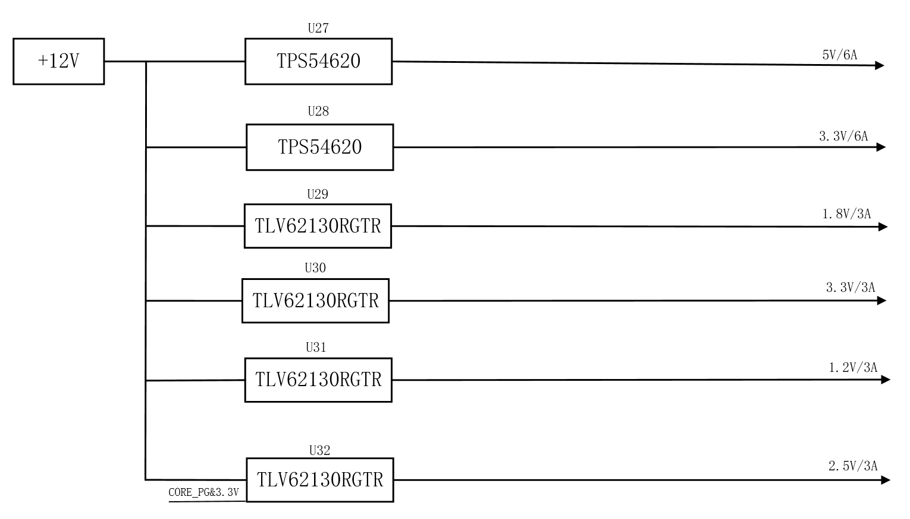
图 15：电源设计连接图

### LED灯

PB7K325 扩展板上共配置了 4 个 LED 指示灯，其中：

- 1 个电源指示灯（PWR）：用于指示扩展板是否正常接收到 12 V 电源，系统上电后该灯常亮；
- 3 个用户自定义 LED 灯：通过 FPGA I/O 控制输出状态，用户可根据实际需求将其用于显示系统状态、调试信息或算法运行标志等。

所有 LED 均采用共阴极接法，限流电阻串联至电源或信号线。LED 的导通与熄灭由驱动引脚的高低电平控制。
下图为 LED 指示灯的硬件连接原理图：

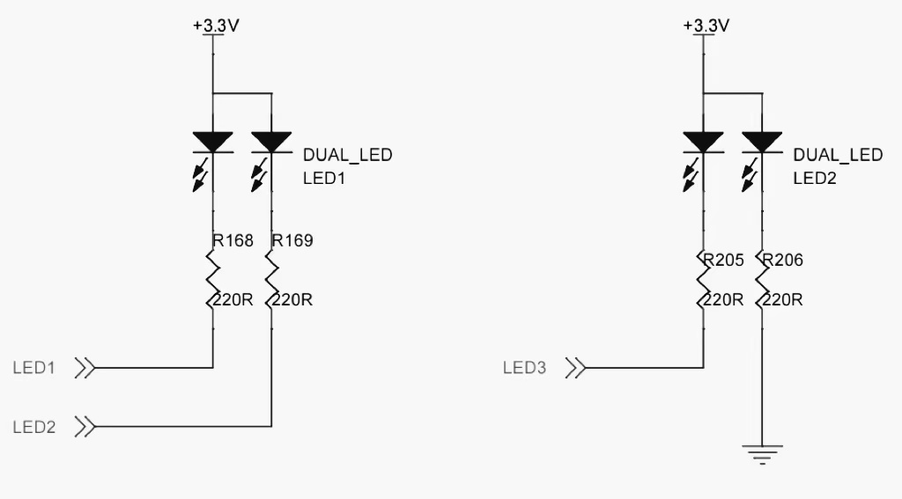
图 16：PB7K325扩展板LED灯连接图

**LED灯的引脚分配**

| 信号名称     | XC7K325引脚名   | XC7K325引脚号  |
|----------------|------------------|------|
| LED1        | B13_L3_P        | Y28  |
| LED2        | B13_L3_N        | AA28 |
| LED3        | B13_L4_P        | W29  |

表 11：LED灯的引脚配置

### 风扇

PB7K325扩展板上包含了一个散热风扇。为保证FPGA主芯片（型号：XC7K325T-2FFG900I，由AMD公司提供）在高性能应用场景下的热稳定性，扩展板配备了主动散热风扇系统。风扇供电通常由板载12V电源直接驱动，并通过MOS管或三极管进行开关控制，同时可选配PWM调速功能以动态调节风扇转速，降低系统噪声并延长风扇寿命。

风扇控制信号一般来自FPGA的IO口，控制信号通过开漏驱动器控制MOSFET导通与否，实现对风扇的启停管理。根据上海派普蓝电子科技有限公司的设计规范，风扇控制电路同时具备过流保护和EMI滤波处理，以确保在工业环境下的稳定运行。风扇部分的电路原理图如下图所示：

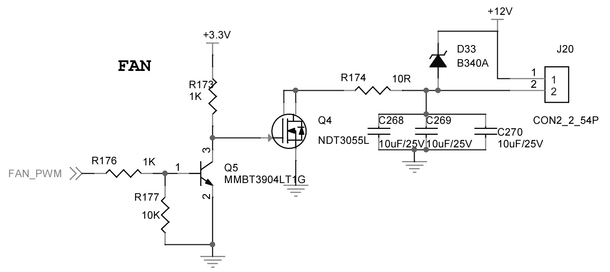
图 17：风扇连接图

**风扇的引脚分配**

| 信号名称     | XC7K325引脚名   | XC7K325引脚号  |
|----------------|------------------|------|
|FAN_PWM    | B13_L10_N | AB30 |

表 12：风扇的引脚配置

### 4路GMSL接口

PB7K325 扩展板上有一个 4 路 GMSL 接口模块，采用 1 片美信（Maxim Integrated）的解码器芯片 MAX96712 实现 4 路摄像头视频解码功能。MAX96712 芯片是一款符合车规级标准的 4 通道高速串行视频解码器，支持 GMSL1 和 GMSL2 两种通信协议，串行链路速率分别支持最高 3Gbps 与 6Gbps，可满足远距离、实时图像采集传输的高带宽需求。

摄像头物理连接采用高可靠性的四合一 FAKRA 车规同轴连接器，具备良好的电磁兼容性与抗干扰性能，适用于严苛的工业与车载环境。

MAX96712 将接收到的多路串行视频信号转换为单路 4-Lane MIPI CSI-2 接口信号，并与 AMD公司提供的 XC7K325T-2FFG900I FPGA芯片 的 高速BANK 相连，实现高效的视频数据接入与并行处理。该系统支持多种主流图像数据格式，如 RAW8/10/12/14/16/20，RGB565/666/888，YUV422 8/10bit，便于后续图像处理、AI识别等算法的部署。

此外，解码器支持通过 I2C总线 配置远端摄像头模块参数，具备链路自动均衡、CRC错误检测等功能，增强系统可靠性。在 GMSL1模式 下支持传输距离最长可达 40 米（3Gbps），在 GMSL2模式 下最远可达 20 米（6Gbps），非常适合高带宽、长距离的视频采集系统。
4路 GMSL 接口的设计连接图与 POC（Power over Coax）供电电路设计图 如下所示：

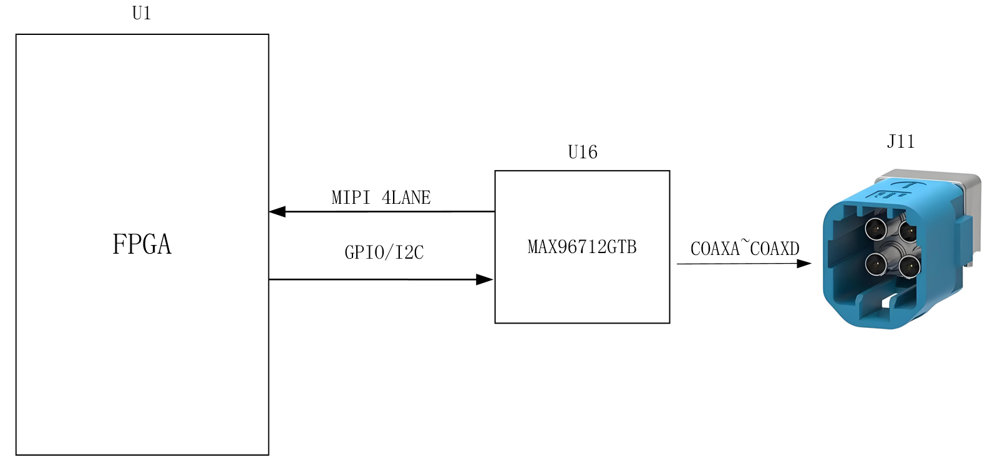
图 18：GMSL接口的设计连接图

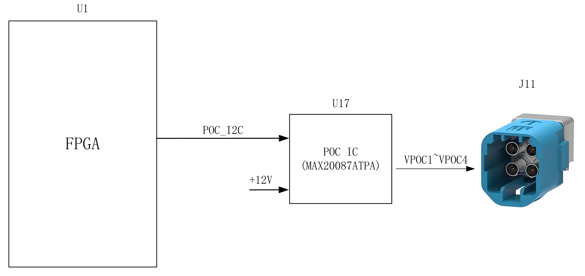
图 19：GMSL接口的POC供电设计图

**GMSL接口的引脚分配**

| 信号名称     | XC7K325引脚名       | XC7K325引脚号              |
|-------------------|------------|-----|
| CSI1_LP_CLK_N     | B18_L10_N  | H12 |
| CSI1_LP_CLK_P     | B18_L10_P  | H11 |
| CSI1_LP0_N        | B18_L18_N  | C11 |
| CSI1_LP0_P        | B18_L18_P  | D11 |
| CSI1_LP1_N        | B18_L21_N  | C14 |
| CSI1_LP1_P        | B18_L21_P  | D14 |
| CSI1_LP2_N        | B18_L20_N  | E15 |
| CSI1_LP2_P        | B18_L20_P  | E14 |
| CSI1_LP3_N        | B18_L22_N  | A13 |
| CSI1_LP3_P        | B18_L22_P  | B13 |
| CSI1_LVDS_CLK_N   | B18_L12_N  | F13 |
| CSI1_LVDS_CLK_P   | B18_L12_P  | G13 |
| CSI1_LVDS_HS0_N   | B18_L2_N   | K15 |
| CSI1_LVDS_HS0_P   | B18_L2_P   | L15 |
| CSI1_LVDS_HS1_N   | B18_L1_N   | K16 |
| CSI1_LVDS_HS1_P   | B18_L1_P   | L16 |
| CSI1_LVDS_HS2_N   | B18_L3_N   | L13 |
| CSI1_LVDS_HS2_P   | B18_L3_P   | L12 |
| CSI1_LVDS_HS3_N   | B18_L4_N   | J13 |
| CSI1_LVDS_HS3_P   | B18_L4_P   | K13 |
| CSI2_LP_CLK_N     | B17_L21_N  | A21 |
| CSI2_LP_CLK_P     | B17_L21_P  | A20 |
| CSI2_LP0_N        | B17_L12_N  | E20 |
| CSI2_LP0_P        | B17_L12_P  | F20 |
| CSI2_LP1_N        | B17_L11_P  | F21 |
| CSI2_LP1_P        | B17_L11_N  | E21 |
| CSI2_LP2_N        | B17_L23_P  | B22 |
| CSI2_LP2_P        | B17_L23_N  | A22 |
| CSI2_LP3_N        | B17_L9_P   | G22 |
| CSI2_LP3_P        | B17_L9_N   | F22 |
| CSI2_LVDS_CLK_N   | B17_L13_N  | D18 |
| CSI2_LVDS_CLK_P   | B17_L13_P  | D17 |
| CSI2_LVDS_HS0_N   | B17_L15_N  | C16 |
| CSI2_LVDS_HS0_P   | B17_L15_P  | D16 |
| CSI2_LVDS_HS1_N   | B17_L14_N  | D19 |
| CSI2_LVDS_HS1_P   | B17_L14_P  | E19 |
| CSI2_LVDS_HS2_N   | B17_L5_P   | L17 |
| CSI2_LVDS_HS2_P   | B17_L5_N   | L18 |
| CSI2_LVDS_HS3_N   | B17_L20_N  | A17 |
| CSI2_LVDS_HS3_P   | B17_L20_P  | A16 |
| GMSL_GPI0         | B16_L5_N   | E26 |
| GMSL_GPI1         | B16_L5_P   | F26 |
| GMSL_GPI2         | B16_L24_N  | G30 |
| GMSL_GPI3         | B16_L24_P  | H30 |
| GMSL_GPIO0        | B16_L3_P   | F25 |
| GMSL_GPIO1        | B16_L3_N   | E25 |
| GMSL_GPIO3        | B16_L17_N  | A30 |
| GMSL_GPIO5        | B16_L17_P  | B30 |
| GMSL_PWDNB        | B16_L22_P  | G29 |
| GMSL_SCL          | B16_L23_N  | H27 |
| GMSL_SDA          | B16_L23_P  | H26 |
| POC_SCL           | B16_L4_P   | E24 |
| POC_SDA           | B16_L4_N   | D24 |

表 13：GMSL接口的引脚配置

### 12G SDI接口

PB7K325扩展板上有 2 路 12G SDI 接口，每路 SDI 接口均支持独立配置为输入或输出模式，灵活适应多种视频采集与播出应用场景。每通道支持最高 11.88Gbps 的传输速率，满足超高清视频传输标准。

2 路 SDI 视频信号通过板载等长差分线设计并匹配 75 欧姆特性阻抗，连接至高性能的 HDBNC 车规级连接器（型号：HDBNC-J-P-GN-RA-BH1），确保信号完整性与低反射特性，适应高频宽带传输需求。

该接口模块采用 SEMTECH公司 的车规级双向 12G UHD-SDI 芯片 GS12190 实现高速串行数据的 时钟恢复（Clock Recovery）、信号驱动（Driver） 和 信号均衡（Equalizer） 等关键功能。芯片支持自动识别输入信号格式，内建时钟提取和均衡器，有效提升信号的抗干扰与传输可靠性。

SDI 接口输出的串行视频信号以及从接收端恢复的时钟和数据信号直接连接至 AMD公司提供的 XC7K325T-2FFG900I FPGA 主芯片的 GTX 高速收发器 BANK115，实现 SDI 视频流在 FPGA 内部的实时处理、转码和路由功能。
下图为 XC7K325 芯片与 SDI 接口设计的连接示意图：

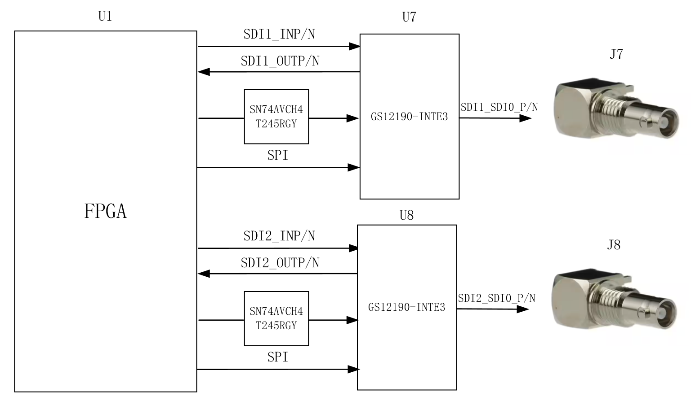
图 20：XC7K325 芯片与SDI接口设计的连接示意图

SDI 的参考时钟是有两路差分晶振提供，一路为 148.5Mhz, 另一路为 148.35Mhz。FPGA内部再通过选择，输出 SDI 的参考时钟给收发器 GTX 的 BANK115 的输入。

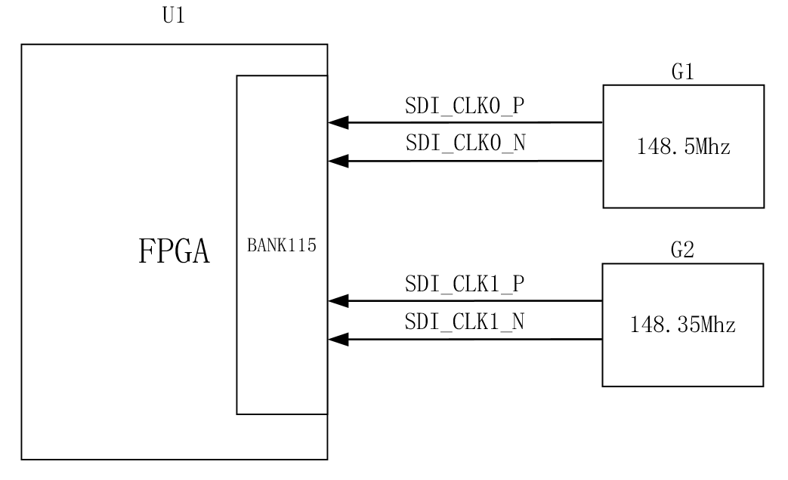
图 21：SDI 的参考时钟示意图

**SDI接口的引脚分配**

| 信号名称     | XC7K325引脚名   | XC7K325引脚号  |
|-------------|-----------------|-----|
| SDI_CLK0_N  | BANK115_CLK0_N  | R7  |  
| SDI_CLK0_P  | BANK115_CLK0_P  | R8  |
| SDI_CLK1_N  | BANK115_CLK1_N  | U7  |
| SDI_CLK1_P  | BANK115_CLK1_P  | U8  |
| SDI1_CABLE  | B16_L12_N       | B25 |
| SDI1_LOCK   | B16_L13_P       | D27 |
| SDI1_LOS    | B16_L13_N       | C27 |
| SDI1_RX_N   | BANK115_RX1_N   | Y5  |
| SDI1_RX_P   | BANK115_RX1_P   | Y6  |
| SDI1_TX_N   | BANK115_TX0_N   | Y1  |
| SDI1_TX_P   | BANK115_TX0_P   | Y2  |
| SDI1_CS     | B16_L10_P       | A25 |
| SDI1_SCLK   | B16_L12_P       | C25 |
| SDI1_SDIN   | B16_L10_N       | A26 |
| SDI1_SDOUT  | B16_L11_P       | D26 |
| SDI1_SLEEP  | B16_L11_N       | C26 |
| SDI2_CABLE  | B16_L21_P       | G27 |
| SDI2_LOCK   | B16_L15_N       | B29 |
| SDI2_LOS    | B16_L15_P       | C29 |
| SDI2_RX_N   | BANK115_RX0_N   | AA3 |
| SDI2_RX_P   | BANK115_RX0_P   | AA4 |
| SDI2_TX_N   | BANK115_TX1_N   | V1  |
| SDI2_TX_P   | BANK115_TX1_P   | V2  |
| SDI2_CS     | B16_L20_P       | G28 |
| SDI2_SCLK   | B16_L21_N       | F27 |
| SDI2_SDIN   | B16_L20_N       | F28 |
| SDI2_SDOUT  | B16_L9_N        | A28 |
| SDI2_SLEEP  | B16_L9_P        | B28 |

表 14：SDI接口的引脚配置

### HDMI 2.0接口

PB7K325扩展板上有一路 HDMI 2.0 输入 和一路 HDMI 2.0 输出 接口，采用集成化的 二合一 HDMI 高速连接器，整体设计紧凑，适配对空间要求高的工业及嵌入式应用场景。系统最高支持 4K@60Hz 的高清视频信号输入与输出，满足高清图像处理与显示需求。

在信号链设计方面，HDMI 输入与输出接口均选用了 安森美公司（onsemi） 的高速视频驱动芯片 NB7NQ621M，该芯片具备优异的高速信号传输能力，兼容 HDMI 2.1 与 DisplayPort 1.4 标准，最大支持数据速率达 12Gbps，可满足未来高分辨率图像应用的接口升级需求。

NB7NQ621M 芯片具备 TMDS 信号电平转换、重驱动（Re-driver） 和 接收端均衡（EQ）功能，在复杂 PCB 走线环境中显著增强信号完整性，有效补偿因高速传输造成的信号衰减与抖动，提高系统的可靠性与兼容性。

HDMI 接口与 AMD公司提供的 XC7K325T-2FFG900I FPGA 主芯片 通过 GTH 高速收发器通道 直接连接，在接口物理层与协议解析层之间形成完整的 HDMI 视频数据链路，实现视频输入、处理、显示闭环控制。
一路 HDMI 输入和一路 HDMI 输出接口设计的示意图如下图所示：

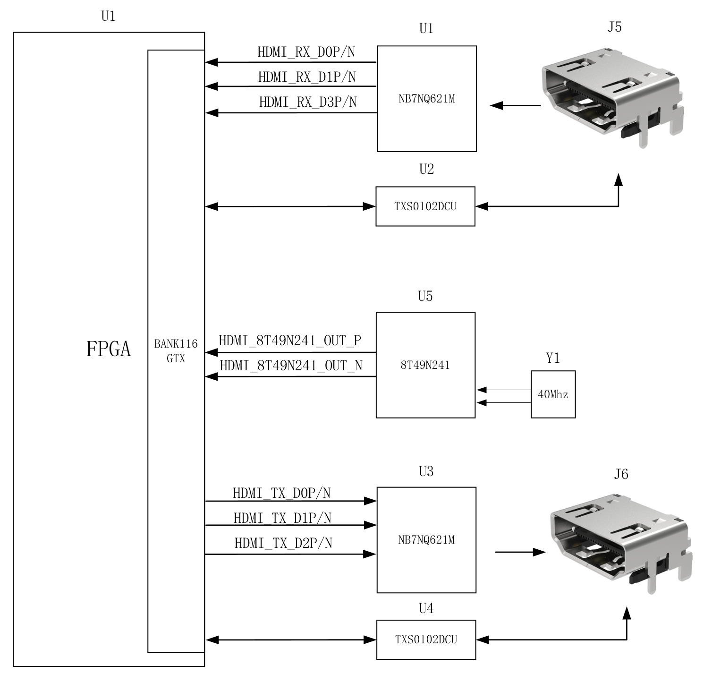
图 22：HDMI接口设计的示意图

**HDMI2.0接口的引脚分配**

| 信号名称     | XC7K325引脚名   | XC7K325引脚号  |
|------------------------|-----------------|-----|
| HDMI_8T49N241_INT_ALM  | B15_L2_N        | L23 |  
| HDMI_8T49N241_LOL      | B15_L1_P        | J23 |
| HDMI_8T49N241_OUT_N    | BANK116_CLK0_N  | L7  |
| HDMI_8T49N241_OUT_P    | BANK116_CLK0_P  | L8  |
| HDMI_8T49N241_RST      | B15_L2_P        | L22 |
| HDMI_CLK_REC_SCL       | B15_L18_P       | N25 |
| HDMI_CLK_REC_SDA       | B15_L18_N       | N26 |
| HDMI_REC_CLOCK_N       | B18_L5_N        | J14 |
| HDMI_REC_CLOCK_P       | B18_L5_P        | K14 |
| HDMI_TX_DSCL           | B15_L10_N       | J26 |
| HDMI_TX_DSDA           | B15_L10_P       | K26 |
| HDMI_TX_SCL            | B15_L14_P       | M28 |
| HDMI_TX_SDA            | B15_L14_N       | L28 |
| HDMI_TX_SRC_HPD        | B16_L6_P        | G23 |
| HDMI_TX_HP_DEC         | B15_L1_N        | J24 |
| HDMI_TX_D0N            | BANK116_TX2_N   | M1  |
| HDMI_TX_D0P            | BANK116_TX2_P   | M2  |
| HDMI_TX_D1N            | BANK116_TX1_N   | N3  |
| HDMI_TX_D1P            | BANK116_TX1_P   | N4  |
| HDMI_TX_D2N            | BANK116_TX0_N   | P1  |
| HDMI_TX_D2P            | BANK116_TX0_P   | P2  |
| HDMI_TX_D3N            | BANK116_TX3_N   | L3  |
| HDMI_TX_D3P            | BANK116_TX3_P   | L4  |

表 15：HDMI接口的引脚配置

### M.2 SSD接口

PB7K325扩展板上有一个 PCIe 2.0 x4 标准的 M.2 接口，用于连接 NVMe 协议的 SSD 固态硬盘，实现高速大容量数据读写。该接口为 FPGA 系统提供稳定可靠的非易失性存储资源，用户的数据文件与系统配置文件均可直接存储在 SSD 中，便于应用部署与系统升级。

该 M.2 接口采用 M Key 插槽，仅支持 PCIe 总线协议，不支持 SATA 协议。因此用户在选择 SSD 固态硬盘时，需确保所选为 PCIe 接口的 NVMe SSD，否则将无法被识别和访问。

M.2 接口通过 高速差分通道 与 AMD公司提供的 XC7K325T-2FFG900I FPGA 主芯片 的 GTH 收发器 BANK 相连，具备 四通道（x4）PCIe 2.0 带宽，理论总带宽可达 16Gbps，能够满足图像采集、缓存、批量处理等高吞吐场景下对数据存储性能的严苛要求。

接口电气设计严格按照 M.2 PCIe 工业规范布线，保证信号完整性、插拔可靠性与EMC性能，配合 上海派普蓝电子科技有限公司 的高速PCB设计规范进行优化布局。
M.2接口设计示意图如下：

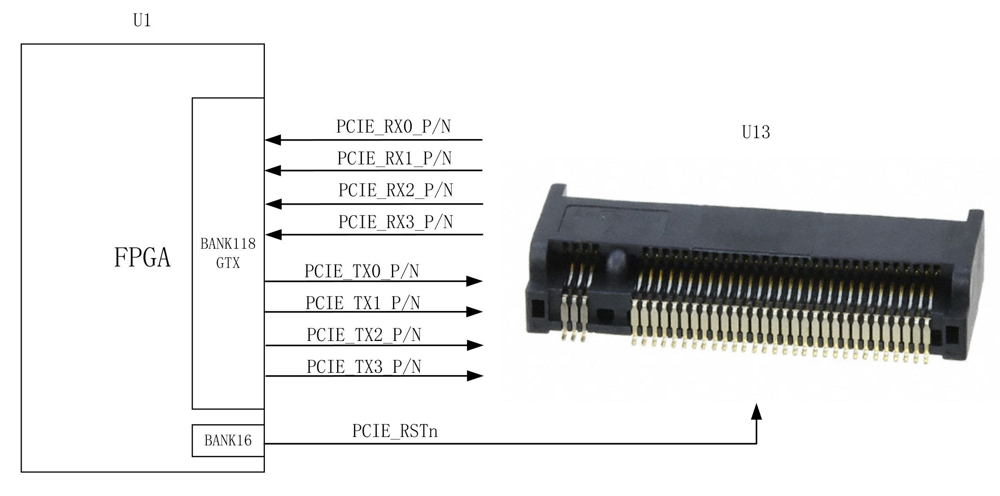
图 23：M.2接口设计的示意图

**M.2接口的引脚分配**

| 信号名称     | XC7K325引脚名   | XC7K325引脚号  |
|------------------------|-----------------|-----|
| PCIE_CLK_FPGA_N   | BANK118_CLK0_N   | C7  |  
| PCIE_CLK_FPGA_P   | BANK118_CLK0_P   | C8  |
| PCIE_DEVSLP       | B16_L14_N        | D28 |
| PCIE_PEDET        | B16_L14_P        | E28 |
| PCIE_RSTN         | B16_L22_N        | F30 |
| PCIE_RX0_N        | BANK118_RX0_N    | E3  |
| PCIE_RX0_P        | BANK118_RX0_P    | E4  |
| PCIE_RX1_N        | BANK118_RX1_N    | D5  |
| PCIE_RX1_P        | BANK118_RX1_P    | D6  |
| PCIE_RX2_N        | BANK118_RX2_N    | B5  |
| PCIE_RX2_P        | BANK118_RX2_P    | B6  |
| PCIE_RX3_N        | BANK118_RX3_N    | A7  |
| PCIE_RX3_P        | BANK118_RX3_P    | A8  |
| PCIE_TX0_N        | BANK118_TX0_N    | D1  |
| PCIE_TX0_P        | BANK118_TX0_P    | D2  |
| PCIE_TX1_N        | BANK118_TX1_N    | C3  |
| PCIE_TX1_P        | BANK118_TX1_P    | C4  |
| PCIE_TX2_N        | BANK118_TX2_N    | B1  |
| PCIE_TX2_P        | BANK118_TX2_P    | B2  |
| PCIE_TX3_N        | BANK118_TX3_N    | A3  |
| PCIE_TX3_P        | BANK118_TX3_P    | A4  |

表 16：M.2接口的引脚配置

### 40针扩展接口

扩展口 J21 为 40 管脚的 2.54mm 双排排针连接器，用于用户扩展更多类型的外设和功能模块，具备良好的兼容性和系统拓展能力。可支持扩展的模块包括：ADDA 模块、液晶显示屏模块、千兆以太网模块、音频输入输出模块、矩阵键盘模块、500W 双目视觉摄像头模块等，适用于多种嵌入式图像处理、信号采集与人机交互场景。

扩展口上提供完整的供电与信号资源，包括 5V 电源 1 路，3.3V 电源 2 路，地 3 路，以及 IO 信号口 34 路。所有 IO 信号均直接连接至 AMD公司提供的 XC7K325T-2FFG900I FPGA 主芯片的通用 IO BANK，默认电平为 3.3V。为满足不同外设的电平匹配需求，部分 IO 可通过更换开发板上电源芯片 （SPX3819M5-3-3），将工作电平调整为其它合适值。

**注意**：禁止直接将扩展口 IO 与 5V 电平设备相连，以防损坏 FPGA 器件。如需连接 5V 电平外设，建议使用电平转换芯片进行隔离与匹配，确保 FPGA IO 工作在安全范围。

在扩展口与 FPGA IO 之间，设计中串联了 33 欧姆阻值的排阻，作为信号过冲抑制和静电防护元件，可有效防止外部高电压/大电流意外冲击造成的 FPGA损伤。
此外，在 PCB 设计中，对于高频率或高速切换的 IO 信号，P/N 信号对采用差分布线设计，并严格控制差分阻抗为 100 欧姆，以提高信号完整性和抗干扰能力。
扩展口 (J21) 的电路如图所示：

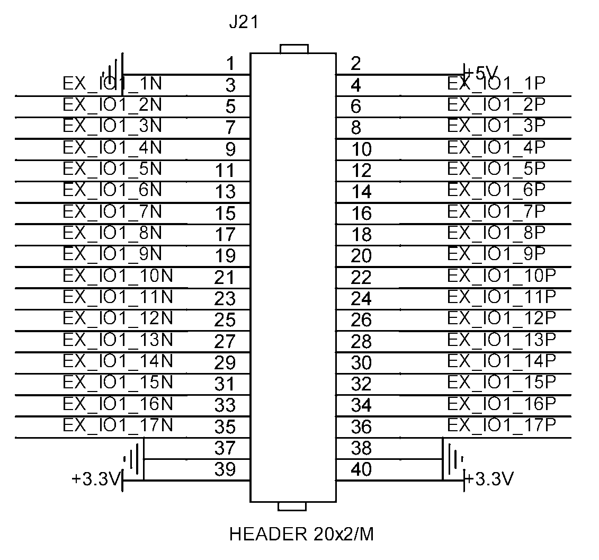
图 24：J21扩展接口原理图

**40针扩展接口的引脚分配**

| 信号名称     | XC7K325引脚名   | XC7K325引脚号  |
|-----------|-------------|-------|
| IO1_1N    | B13_L12_N   | AC27  |
| IO1_1P    | B13_L12_P   | AB27  |
| IO1_2N    | B13_L1_P    | Y26   |
| IO1_2P    | B13_L1_N    | AA26  |
| IO1_3N    | B13_L20_N   | AK28  |
| IO1_3P    | B13_L20_P   | AJ27  |
| IO1_4N    | B12_L9_N    | AD24  |
| IO1_4P    | B12_L9_P    | AC24  |
| IO1_5N    | B13_L22_N   | AH27  |
| IO1_5P    | B13_L22_P   | AH26  |
| IO1_6N    | B13_L24_N   | AK26  |
| IO1_6P    | B13_L24_P   | AJ26  |
| IO1_7N    | B13_L19_N   | AD26  |
| IO1_7P    | B13_L19_P   | AC26  |
| IO1_8N    | B12_L8_N    | AD22  |
| IO1_8P    | B12_L8_P    | AC22  |
| IO1_9N    | B12_L15_N   | AK25  |
| IO1_9P    | B12_L15_P   | AJ24  |
| IO1_10N   | B12_L18_N   | AH25  |
| IO1_10P   | B12_L18_P   | AG25  |
| IO1_11N   | B12_L7_N    | AC25  |
| IO1_11P   | B12_L7_P    | AB24  |
| IO1_12N   | B12_L4_P    | AA22  |
| IO1_12P   | B12_L4_N    | AA23  |
| IO1_15N   | B12_L6_N    | AB20  |
| IO1_15P   | B12_L6_P    | AA20  |
| IO1_16N   | B12_L10_N   | AE21  |
| IO1_16P   | B12_L10_P   | AD21  |
| IO1_17N   | B12_L3_N    | AB23  |
| IO1_17P   | B12_L3_P    | AB22  |

表 17：40针扩展接口的引脚配置

### UART接口

PB7K325扩展板上配备了一个 UART 转 TYPE-C 接口，用于系统的串口调试与供电功能。该接口使用 Silicon Labs 公司的 CP2102GM USB-UART 转换芯片，具备稳定可靠的串口转接能力，广泛应用于工业级嵌入式调试场景。

接口形式为 TYPE-C 接头，用户只需使用一根 TYPE-C 线缆即可完成与上位机（PC）之间的连接，实现核心板的独立供电以及 UART 串口通信功能。该接口简化了调试过程，适用于无额外电源情况下的快速开发、串口打印输出和远程固件升级等功能。

本模块在硬件设计中集成了 USB 协议的必要隔离与静电保护电路，增强系统的稳定性与抗干扰能力，符合工业级调试口的设计规范，并根据上海派普蓝电子科技有限公司的设计标准进行了优化布局与接口防护处理。
UART 电路设计的示意图如下图所示：

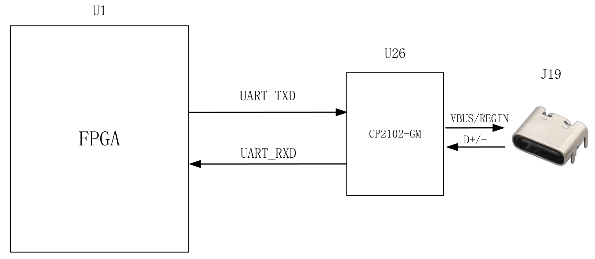
图 25：UART接口连接图

**UART接口的引脚分配**

| 信号名称     | XC7K325引脚名   | XC7K325引脚号  |
|-----------|-------------|-------|
| UART_RXD   | B13_L5_P   | AA27 |
| UART_TXD   | B13_L2_N   | W28  |

表 18：UART接口的引脚配置

### CAN接口

PB7K325扩展板上配备了 2 路 CAN 通信接口，支持用户在工业控制、传感器网络、汽车电子等场景中进行高可靠性的总线通信。该接口使用 TI（德州仪器）公司的高性能 SN65HVD232C CAN 收发芯片，为用户提供稳定的 CAN 总线物理层支持。

SN65HVD232C 芯片符合 ISO 11898 标准，支持高速 CAN 通信，具备抗干扰能力强、EMI 较低、低功耗等特点，适合复杂电磁环境下的通信需求。其接收与发送信号分别与 AMD公司提供的 XC7K325T-2FFG900I FPGA 主芯片 的 IO BANK 连接，通过软硬件协同实现 CAN 协议的数据解析与逻辑处理。

扩展板上的 CAN 接口默认工作电平为 3.3V，设计中加入了过压保护与ESD防护电路，确保系统在长期运行中具备良好的鲁棒性，符合 上海派普蓝电子科技有限公司 工业级接口设计规范。
下图为 CAN 收发芯片的连接示意图：

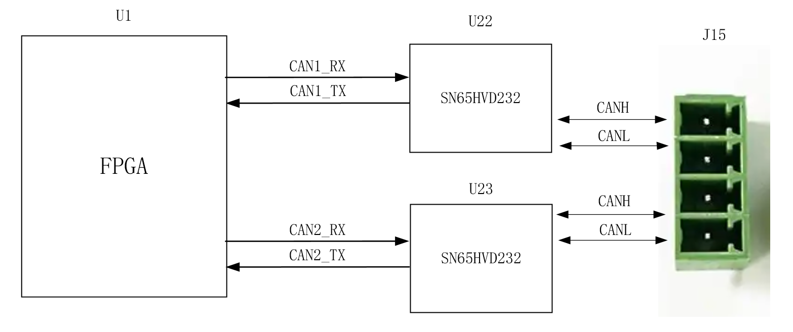
图 26：CAN接口连接图

**CAN接口的引脚分配**

| 信号名称     | XC7K325引脚名   | XC7K325引脚号  |
|-----------|-------------|-------|
| CAN1_RX   | B15_L7_N   | H29  |
| CAN1_TX   | B15_L7_P   | J29  |
| CAN2_RX   | B15_L8_N   | J28  |
| CAN2_TX   | B15_L8_P   | J27  |

表 19：CAN接口的引脚配置

### 485 通信接口

PB7K325扩展板上配备了 2 路 RS-485 通信接口，可满足用户在工业自动化、串口设备联机、远距离控制等应用场景中的通信需求。该接口采用 MAXIM 公司的高性能收发芯片 MAX3485，为用户提供稳定可靠的 半双工 RS-485 总线通信能力。

MAX3485 芯片具有 低功耗、高速（最高支持 10Mbps） 传输特性，兼容 RS-485 标准，具备良好的抗干扰性能和总线驱动能力。其收发信号与 AMD 公司提供的 XC7K325T-2FFG900I FPGA 芯片 的 IO BANK 直接连接，实现灵活可编程的协议解析与数据交换。

该通信接口设计中包含必要的 ESD 保护、过压防护及端接匹配电阻，确保在复杂电磁环境下通信的稳定性与可靠性，符合上海派普蓝电子科技有限公司的工业级扩展板接口设计标准。
下图为 485 收发芯片的连接示意图：

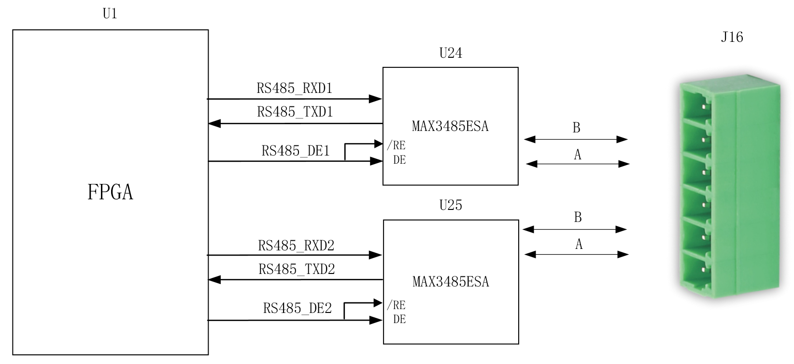
图 27：485 通信接口连接图

**485 通信接口的引脚分配**

| 信号名称     | XC7K325引脚名   | XC7K325引脚号  |
|-----------|-------------|-------|
| RS485_DE1    | B15_L21_N    | N24 |
| RS485_RXD1   | B15_L24_N    | M23 |
| RS485_TXD1   | B15_L24_P    | M22 |
| RS485_DE2    | B15_L21_P    | P23 |
| RS485_RXD2   | B15_L3_N     | K24 |
| RS485_TXD2   | B15_L3_P     | K23 |

表 20：485 通信接口的引脚配置

### 千兆以太网接口

PB7K325扩展板通过 Realtek RTL8211E-VL 以太网PHY芯片为上海派普蓝电子科技有限公司的视频平台提供网络通信服务。该芯片支持 10/100/1000 Mbps 自适应网络传输速率，通过 RGMII接口 与AMD FPGA系统的MAC层进行数据通信，复位时间要求大于10毫秒，如果需要改变延时，可以配置PHY寄存器。

PHY芯片具备以下关键特性：

- MDI/MDX自动检测与切换
- 传输速率自适应（10/100/1000 Mbps）
- Master/Slave时钟模式自适应
- 通过 MDIO总线 实现PHY寄存器管理
RTL8211E-VL上电时将检测特定 配置引脚的电平状态 以确定初始工作模式。

下表描述GPHY芯片上电后的默认设定信息：

| 配置 Pin 脚     | 说明   | 配置值  |
|-----------|-------------|-------|
| PHYAD[2:0] | MDIO/MDC 模式的 PHY 地址    | PHY Address 为 001   |
| SELRGV     | RGMII 1.8V 或 1.5V 电平选择 | 1.8V                 |
| AN[1:0]    | 自协商配置                  | (10/100/1000M)自适应 |
| RX Delay   | RX 时钟 2ns 延时            | 延时                 |
| TX Delay   | TX 时钟 2ns 延时            | 不延时                |

表 21：千兆以太网PHY芯片默认配置

当网络连接到千兆以太网时，FPGA 和 PHY 芯片 RTL8211E-VL 的数据传输时通过 RGMII 总线通信，传输时钟为 125Mhz，数据在时钟的上升沿和下降样采样。当网络连接到百兆以太网时，FPGA 和 PHY 芯片 RTL8211E-VL 的数据传输时通过 RMII 总线通信，传输时钟为 25Mhz。数据在时钟的上升沿和下降样采样。
下图为 FPGA 与以太网 PHY 芯片连接示意图:

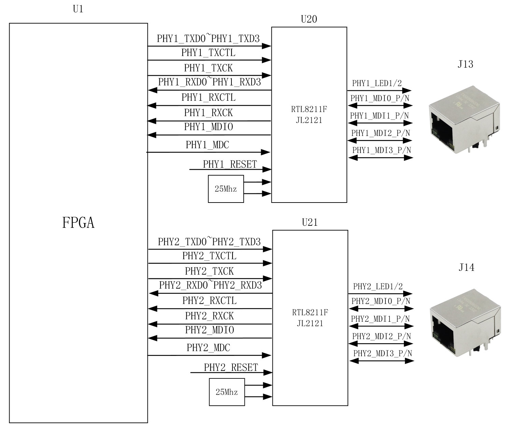
图 28：千兆以太网接口连接图

**千兆以太网接口J13的引脚分配**

| 信号名称     | XC7K325引脚名   | XC7K325引脚号  |
|-----------|-------------|-------|
| PHY1_MDC     | B13_L6_P    | AA25 |
| PHY1_MDIO    | B13_L6_N    | AB25 |
| PHY1_RESET   | B13_L5_N    | AB28 |
| PHY1_RXCK    | B13_L13_P   | AG29 |
| PHY1_RXCTL   | B13_L14_P   | AE28 |
| PHY1_RXD0    | B13_L23_P   | AF26 |
| PHY1_RXD1    | B13_L23_N   | AF27 |
| PHY1_RXD2    | B13_L16_N   | AF30 |
| PHY1_RXD3    | B13_L16_P   | AE30 |
| PHY1_TXCK    | B13_L18_P   | AG30 |
| PHY1_TXCTL   | B13_L18_N   | AH30 |
| PHY1_TXD0    | B13_L17_P   | AJ28 |
| PHY1_TXD1    | B13_L17_N   | AJ29 |
| PHY1_TXD2    | B13_L15_P   | AK29 |
| PHY1_TXD3    | B13_L15_N   | AK30 |

表 22：千兆以太网接口J13的引脚配置

**千兆以太网接口J14的引脚分配**

| 信号名称     | XC7K325引脚名   | XC7K325引脚号  |
|-----------|-------------|-------|
| PHY2_MDC     | B13_L10_P   | AB29 |
| PHY2_MDIO    | B13_L9_P    | AD29 |
| PHY2_RESET   | B13_L9_N    | AE29 |
| PHY2_RXCK    | B15_L13_P   | K28  |
| PHY2_RXCTL   | B15_L19_N   | N20  |
| PHY2_RXD0    | B15_L15_P   | M29  |
| PHY2_RXD1    | B15_L15_N   | M30  |
| PHY2_RXD2    | B15_L22_P   | P21  |
| PHY2_RXD3    | B15_L22_N   | P22  |
| PHY2_TXCK    | B15_L19_P   | N19  |
| PHY2_TXCTL   | B15_L17_N   | N30  |
| PHY2_TXD0    | B15_L23_P   | M24  |
| PHY2_TXD1    | B15_L23_N   | M25  |
| PHY2_TXD2    | B15_L11_P   | L26  |
| PHY2_TXD3    | B15_L11_N   | L27  |

表 23：千兆以太网接口J14的引脚配置

### SFP+光纤接口

PB7K325扩展板上配备了 2 路光纤接口，用于高速光纤数据通信。用户可根据实际应用需求，插入市面通用的 SFP 光模块（支持 1.25G、2.5G、10G 等标准速率），实现点对点的光链路传输，广泛应用于数据中心互联、高速网络通信等场景。

这 2 路光纤接口通过标准 SFP Cage 结构分别连接至 AMD公司提供的 XC7K325T-2FFG900I FPGA 芯片 BANK117 的 GTX 高速收发器。每组 SFP 接口包含 1 路 TX（发送）与 1 路 RX（接收），共计使用 BANK117 中的 4 路 GTX 通道。单通道数据传输速率可高达 10Gb/s，充分满足大数据量、高带宽通信需求。
BANK117 的 GTX 收发器模块所需的参考时钟由扩展板提供的 156.25 MHz 差分晶振时钟源供给，确保多通道光模块通信的频率同步与抖动控制，提升系统整体的信号稳定性与误码性能。

该接口部分的信号完整性设计、阻抗控制及功耗优化均遵循 上海派普蓝电子科技有限公司 的高速通信模块设计规范，确保长期稳定运行。
FPGA 和光纤设计示意图如下图所示：

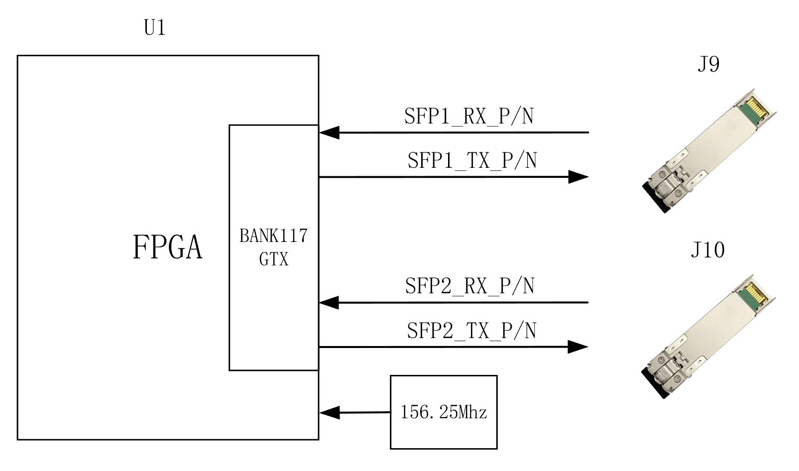
图 29：SFP+光纤接口连接图

**SFP+光纤接口的引脚分配**

| 信号名称     | XC7K325引脚名   | XC7K325引脚号  |
|----------------|------------------|------|
| SFP_CLK_N      | BANK117_CLK0_N   | G7   |
| SFP_CLK_P      | BANK117_CLK0_P   | G8   |
| SFP1_IIC_SCL   | B16_L7_N         | A27  |
| SFP1_IIC_SDA   | B16_L7_P         | B27  |
| SFP1_LOSS      | B16_L18_P        | E29  |
| SFP1_TX_DIS    | B16_L18_N        | E30  |
| SFP1_RX_N      | BANK117_RX0_N    | K5   |
| SFP1_RX_P      | BANK117_RX0_P    | K6   |
| SFP1_TX_N      | BANK117_TX0_N    | K1   |
| SFP1_TX_P      | BANK117_TX0_P    | K2   |
| SFP2_IIC_SCL   | B16_L8_P         | C24  |
| SFP2_IIC_SDA   | B16_L8_N         | B24  |
| SFP2_LOSS      | B16_L16_P        | D29  |
| SFP2_TX_DIS    | B16_L16_N        | C30  |
| SFP2_RX_N      | BANK117_RX1_N    | H5   |
| SFP2_RX_P      | BANK117_RX1_P    | H6   |
| SFP2_TX_N      | BANK117_TX1_N    | J3   |
| SFP2_TX_P      | BANK117_TX1_P    | J4   |

表 24：SFP+光纤接口的引脚配置

### MIPI接口

PB7K325扩展板集成 MIPI CSI-2 摄像头接口，为 PB7K325 平台提供原生图像采集能力，可满足高分辨率、低延迟的视频输入需求。该接口可直接连接标准 MIPI 摄像头模组，无需中间转换芯片，实现基于差分信号链路的高速图像数据传输。

MIPI 接口采用 CSI-2 协议标准，支持多路 Data Lane 及独立 Clock Lane 结构，通过与 AMD公司提供的 XC7K325T-2FFG900I FPGA 主芯片的高速IO BANK 对接，可实现图像数据的并行采集、预处理与回传。该架构可广泛应用于计算机视觉、智能交通、安防监控与工业检测等图像处理场景。

在硬件设计中，MIPI 信号通道遵循高速差分布线规范，严格控制阻抗匹配与线长对齐，同时接口电路中加入必要的 静电保护与过压防护措施，确保系统长期稳定运行。整套接口方案设计符合 上海派普蓝电子科技有限公司 的高速图像采集电路设计标准。
MIPI 接口电路原理图如下图所示：

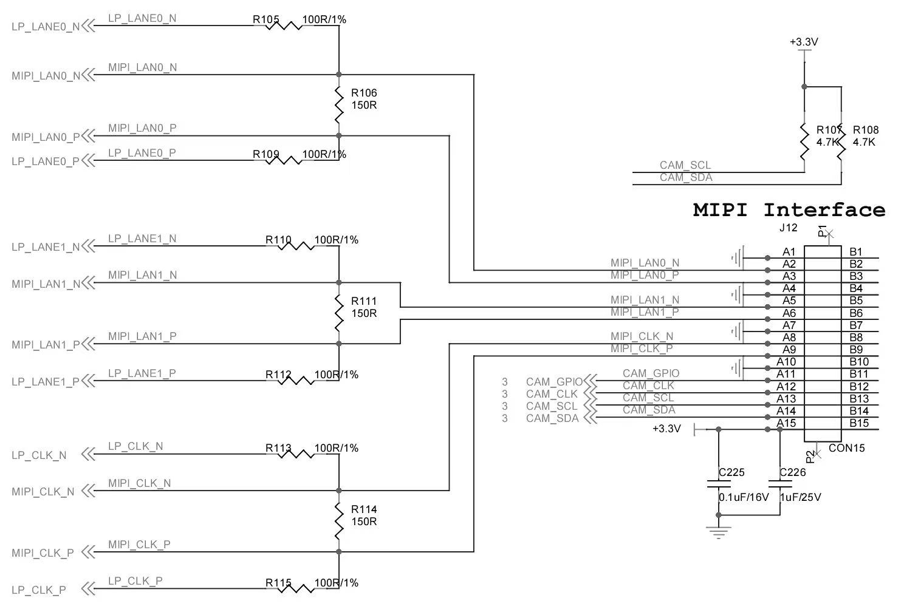
图 30：MIPI接口连接图

**MIPI接口的引脚分配**

| 信号名称     | XC7K325引脚名   | XC7K325引脚号  |
|----------------|------------------|------|
| LP_CLK_N      | B12_L17_N   | AK24 |
| LP_CLK_P      | B12_L17_P   | AK23 |
| LP_LANE0_N    | B12_L14_N   | AH24 |
| LP_LANE0_P    | B12_L14_P   | AG24 |
| LP_LANE1_N    | B12_L20_N   | AH22 |
| LP_LANE1_P    | B12_L20_P   | AG22 |
| CAM_CLK       | B13_L11_P   | AD27 |
| CAM_GPIO      | B13_L11_N   | AD28 |
| CAM_SCL       | B13_L7_N    | AC30 |
| CAM_SDA       | B13_L7_P    | AC29 |
| MIPI_CLK_N    | B12_L12_N   | AE24 |
| MIPI_CLK_P    | B12_L12_P   | AD23 |
| MIPI_LAN0_N   | B12_L16_N   | AF25 |
| MIPI_LAN0_P   | B12_L16_P   | AE25 |
| MIPI_LAN1_N   | B12_L13_N   | AG23 |
| MIPI_LAN1_P   | B12_L13_P   | AF22 |

表 25：MIPI接口的引脚配置

